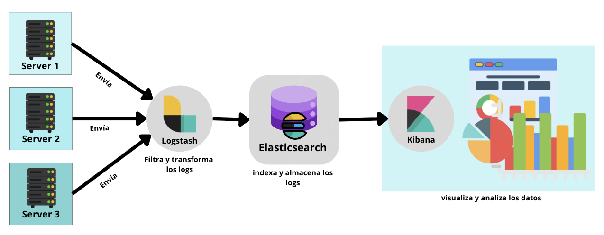
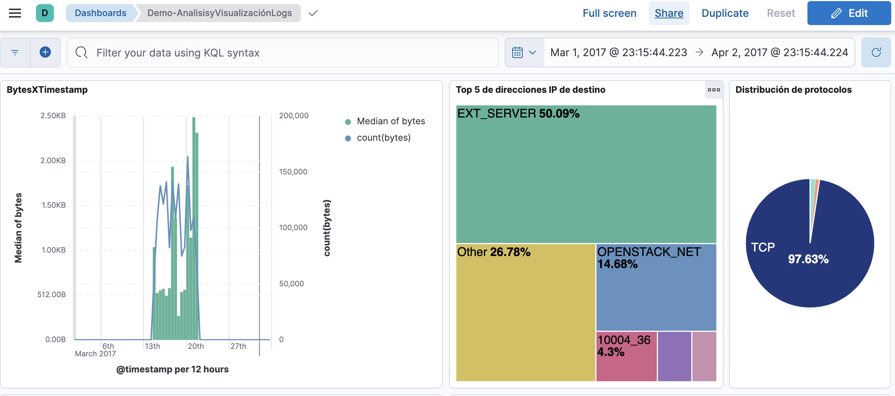
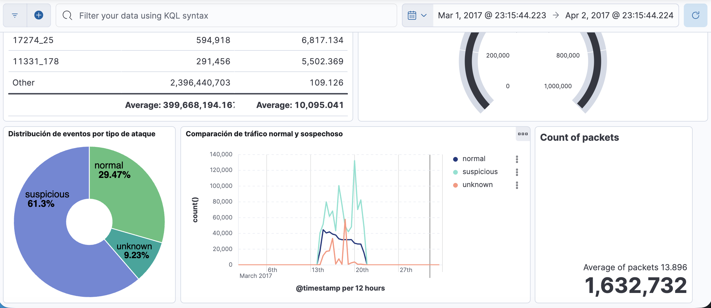
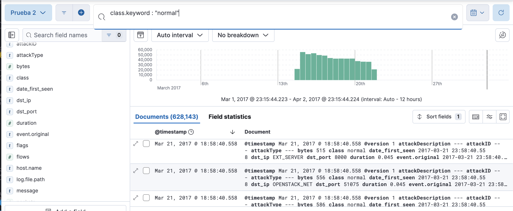
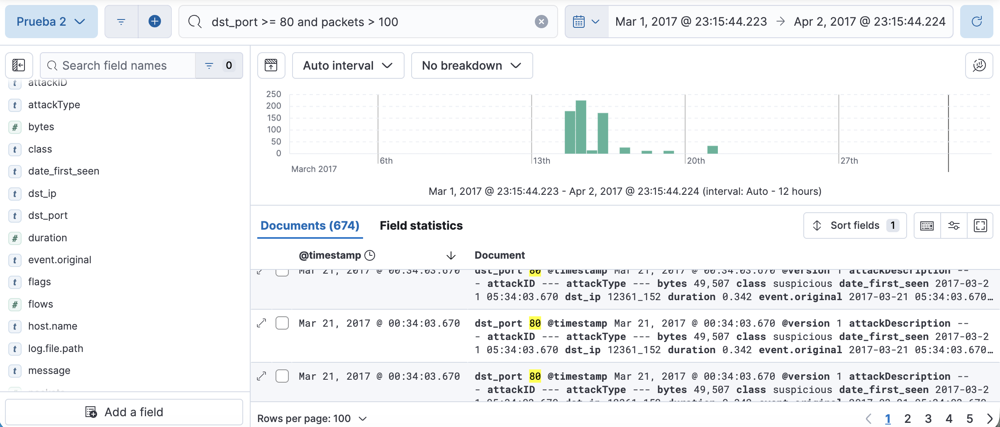
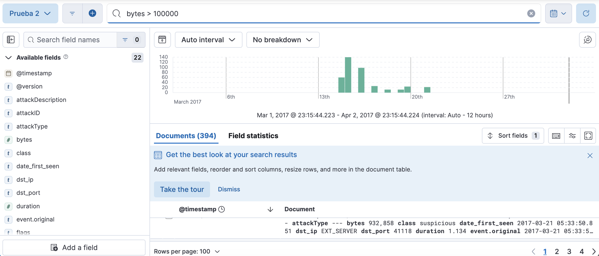
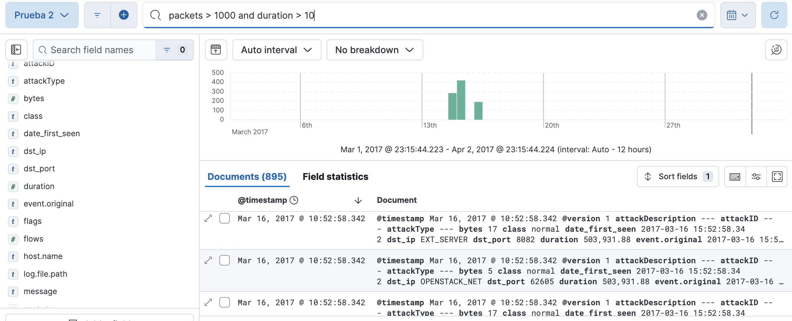
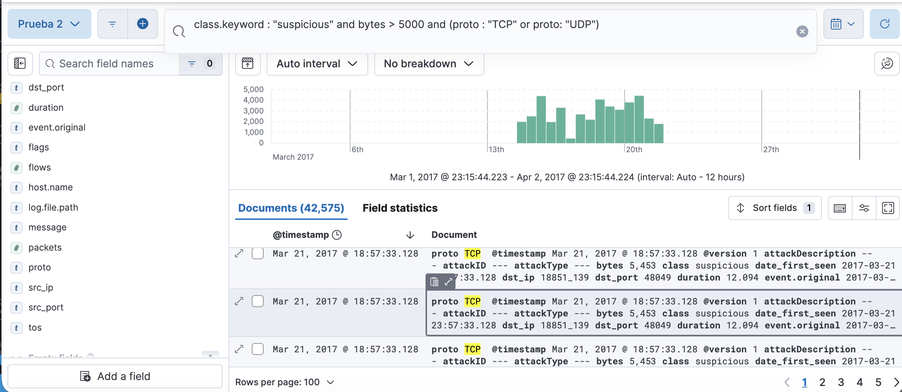

> [0. Acerca del Grupo](../../0.md) › [0.6. Temas Individuales (Parte 1)](../0.6.md) › [0.6.3. Integrante 3](0.6.3.md)

# 0.6.3. Integrante 3

# Análisis y Visualización de Logs

## 1.Desarrollo conceptual

### ¿Qué es el análisis de logs?

El análisis de logs es el proceso de recopilar, procesar e interpretar los registros generados por sistemas, aplicaciones o dispositivos para obtener información útil.
Los logs contienen eventos que describen lo que ocurre dentro de una infraestructura tecnológica (por ejemplo, conexiones de red, errores de servidor, autenticaciones, o tráfico sospechoso).

Analizar estos datos permite:

- Detectar incidentes de seguridad.

- Identificar patrones de uso o fallas recurrentes.

- Medir el rendimiento de servicios.

- Predecir comportamientos anómalos mediante modelos de Machine Learning.

### ¿Qué es la visualización de logs?

La visualización de logs consiste en representar gráficamente los datos procesados para facilitar su interpretación.
Mediante gráficos de líneas, barras, mapas o indicadores, los analistas pueden identificar tendencias, picos de actividad o comportamientos anómalos de forma inmediata.

### Ejemplo:

>En lugar de revisar miles de líneas de texto en un archivo de log, un gráfico puede mostrar cómo el tráfico de red aumentó repentinamente en una hora específica, indicando un posible ataque.

---

### Tipos de Logs

Existen múltiples tipos de logs, según su origen y propósito:

| Tipo de Log | Descripción | Ejemplo |
|--------------|-------------|----------|
| **Logs del sistema** | Registran actividades del sistema operativo, como inicio de servicios o errores del kernel. | `syslog`, `dmesg` |
| **Logs de aplicación** | Capturan eventos dentro de una aplicación, como errores, accesos o transacciones. | `error.log`, `access.log` |
| **Logs de red** | Monitorean el tráfico, conexiones y paquetes transmitidos entre dispositivos. | `firewall.log`, `network_flows.csv` |
| **Logs de seguridad** | Detectan intentos de acceso, autenticaciones fallidas o posibles amenazas. | `auth.log`, `IDS/IPS logs` |

---

### Retos del análisis de logs

**1. Volumen masivo de datos**

Los sistemas modernos generan millones de registros cada día, provenientes de servidores, aplicaciones y dispositivos de red. Esto dificulta su almacenamiento, búsqueda y procesamiento en tiempo real.

**2. Estructura poco uniforme**

Cada fuente de log puede tener un formato distinto (JSON, texto plano, CSV, XML, etc.). Esta falta de estandarización complica la integración y el análisis automatizado de la información.

**3. Ruido o información irrelevante**

Dentro de los logs hay gran cantidad de mensajes que no aportan valor al análisis (información repetitiva o trivial). Filtrar este ruido es esencial para centrarse en los eventos críticos o anómalos.

**4. Detección de patrones y anomalías**

Identificar comportamientos inusuales, ataques o errores requiere técnicas avanzadas de correlación y machine learning. A simple vista, los patrones importantes pueden pasar desapercibidos.

--- 

### Proceso del Análisis de Logs

El análisis de logs sigue una serie de etapas que permiten transformar registros  en información útil para la toma de decisiones o la detección de problemas.

**1. Recolección**

En esta etapa se capturan los logs desde diferentes fuentes. El objetivo es centralizarlos en un solo punto para facilitar su gestión.

**2. Procesamiento**

Aquí los logs se limpian, transforman y enriquecen.

- Se eliminan líneas irrelevantes.
- Se corrige el formato.
- Se agregan datos adicionales, como etiquetas, origen o nivel de severidad.

**3. Almacenamiento**

Los logs ya procesados se guardan en una base de datos optimizada para búsquedas rápidas.
Esto permite hacer consultas complejas incluso sobre millones de registros.

**4. Análisis**

En esta fase se exploran los datos, se ejecutan consultas y se buscan patrones o anomalías.
El análisis puede ser manual o automatizado.

**5. Visualización**

Finalmente, los resultados se presentan mediante gráficos, dashboards o reportes que facilitan la interpretación.
Esto permite detectar rápidamente problemas o tendencias sin tener que revisar líneas de texto.

### La Pila ELK (Elasticsearch – Logstash – Kibana)

La **pila ELK** es una de las soluciones más populares y completas para el **análisis y visualización de logs**.

| **Componente** | **Función**                  | **Descripción** |
|-----------------|------------------------------|-----------------|
| **Logstash**    | Ingesta y procesamiento       | Recibe los logs, aplica filtros (CSV, JSON, GROK), limpia los datos y los envía a Elasticsearch. |
| **Elasticsearch** | Almacenamiento e indexación | Base de datos optimizada para búsquedas y consultas en tiempo real. |
| **Kibana**      | Visualización                | Interfaz gráfica para explorar, analizar y crear dashboards interactivos. |


### Arquitectura general del ELK Stack

La siguiente imagen muestra cómo se integran los tres componentes principales del **ELK Stack**. 

Cada servidor o aplicación **envía sus logs** a **Logstash**, que los **filtra y transforma** antes de enviarlos a **Elasticsearch**, donde se **indexan y almacenan**.  
Finalmente, **Kibana** permite **visualizar y analizar** esa información.


---

### visualización de logs en Kibana

Una vez que los datos son procesados por Logstash y almacenados en Elasticsearch, la herramienta Kibana permite explorar y representar visualmente la información.
Kibana ofrece paneles interactivos, filtros dinámicos y la posibilidad de realizar búsquedas personalizadas sobre los campos de los registros.

---

### Búsqueda de datos con KQL

KQL (Kibana Query Language) es el lenguaje de consulta utilizado dentro de Kibana para filtrar y explorar datos almacenados en Elasticsearch.
Permite realizar búsquedas avanzadas sobre los campos de los documentos, combinando condiciones y operadores lógicos.

---


## 2. Consideraciones técnicas  

### Arquitectura general  

La arquitectura del proyecto se basa en la **Pila ELK (Elasticsearch, Logstash y Kibana)**, desplegada dentro de contenedores Docker para garantizar portabilidad, facilidad de instalación y aislamiento entre servicios.  
Todo el entorno se orquesta mediante **Docker Compose**, lo que permite iniciar o detener toda la pila con un solo comando.  

---

### Requisitos previos  

Antes de ejecutar la demo, es necesario cumplir con los siguientes requisitos técnicos:  

1. **Instalar Docker y Docker Compose**  
   - Permiten desplegar los tres servicios en contenedores independientes sin necesidad de instalación manual.  
   - Docker Compose simplifica el proceso de ejecución con un único archivo `docker-compose.yml`.  

2. **Contar con un archivo de logs**  
   - En este caso se utiliza `network_logs.csv`, el cual contiene registros de tráfico de red, sin embargo se pueden utilizar varios archivos.

3. **Configuración personalizada de Logstash**  
   - Se define en un archivo `.conf` donde se especifican:  
     - La ruta del archivo de entrada.  
     - El formato CSV y sus columnas.  
     - Filtros para normalizar datos.  
     - El destino de salida hacia Elasticsearch.  

4. **Definir un índice en Elasticsearch**  
   - Los datos procesados se almacenan bajo un patrón, lo que permite agrupar los registros por fecha y facilitar su búsqueda posterior.  

# 3. Demo (Código)

## `docker-compose.yml`
Este archivo define la infraestructura del entorno ELK (Elasticsearch, Logstash y Kibana) utilizando **Docker Compose**.  
Cada servicio se ejecuta en un contenedor independiente, lo que facilita la configuración, despliegue y mantenimiento del sistema.

```yaml
services:
  elasticsearch:
    image: docker.elastic.co/elasticsearch/elasticsearch:8.15.0
    container_name: elasticsearch
    environment:
      - discovery.type=single-node
      - xpack.security.enabled=false
    ports:
      - "9200:9200"
    volumes:
      - es_data:/usr/share/elasticsearch/data

  kibana:
    image: docker.elastic.co/kibana/kibana:8.15.0
    container_name: kibana
    ports:
      - "5601:5601"
    environment:
      - ELASTICSEARCH_HOSTS=http://elasticsearch:9200

  logstash:
    image: docker.elastic.co/logstash/logstash:8.15.0
    container_name: logstash
    volumes:
      - ./logstash.conf:/usr/share/logstash/pipeline/logstash.conf
      - ./logs:/usr/share/logstash/logs
    ports:
      - "5044:5044"
      - "9600:9600"

volumes:
  es_data:
```


## `logstash.conf`
Define cómo Logstash procesa y envía los datos de los registros hacia Elasticsearch.
Este archivo se encuentra en la carpeta del proyecto y se ejecuta automáticamente al levantar los contenedores con Docker Compose.

Este archivo realiza tres tareas principales:

| Etapa   | Descripción |
|----------|-------------|
| **Input** | Indica a Logstash de dónde leer los datos. En este caso, de un archivo CSV (`network_logs.csv`). |
| **Filter** | Limpia, transforma y normaliza los datos: convierte tipos de datos, ajusta el formato de fecha y define el campo temporal `@timestamp`. |
| **Output** | Envía los datos procesados a **Elasticsearch**, creando índices con el formato `network-flows-YYYY.MM.dd`. |


```ruby
input {
  file {
    path => "/usr/share/logstash/logs/network_logs.csv"
    start_position => "beginning"
    sincedb_path => "/dev/null"
  }
}

filter {
  csv {
    separator => ","
    skip_header => "true"
    columns => [
      "date_first_seen","duration","proto","src_ip","src_port",
      "dst_ip","dst_port","packets","bytes","flows","flags",
      "tos","class","attackType","attackID","attackDescription"
    ]
  }

  # Normalizamos el campo de tiempo -> lo pasamos a @timestamp
  date {
    match => ["date_first_seen", "yyyy-MM-dd HH:mm:ss.SSS"]
    target => "@timestamp"
  }

  # Convertimos métricas a numéricas
  mutate {
    convert => {
      "duration" => "float"
      "packets" => "integer"
      "bytes" => "integer"
      "flows" => "integer"
    }
  }
}

output {
  elasticsearch {
    hosts => ["http://elasticsearch:9200"]
    index => "network-flows-%{+YYYY.MM.dd}"
  }
  stdout { codec => rubydebug }
}
```

## Importar el Dashboard en Kibana

Para visualizar la **demo del sistema de análisis y visualización de logs** con el mismo dashboard que se creó en el entorno original, es necesario importar el archivo exportado desde Kibana.

####  Pasos para importar el Dashboard:

1. Asegúrate de tener los contenedores del entorno ELK en ejecución.

2. Abre Kibana en tu navegador.

3. Dentro de Kibana. En el menú lateral, entra a:
Stack Management → Saved Objects

4. Haz clic en el botón Import

5. Selecciona el archivo `.ndjson` que se encuentra en la carpeta del proyecto.

6. Una vez completada la importación, ve a:
Analytics → Dashboard,
y abre el dashboard importado para visualizar los gráficos y métricas de la demo.

## Ejemplo del Dashboard en Ejecución

A continuación, se presentan capturas del **dashboard importado en Kibana**, las cuales muestran cómo se visualizan los datos procesados por la pila **ELK (Elasticsearch, Logstash y Kibana)**.

Estas imágenes ilustran los diferentes tipos de gráficos generados a partir de los registros de red, permitiendo observar **tendencias, volúmenes de tráfico y comportamiento de las conexiones**.





## Utiliza KQL

KQL permite combinar condiciones lógicas, operadores de comparación y búsquedas por campos, ofreciendo una gran flexibilidad para el análisis.
Para realizar estas consultas, se debe seguir el siguiente procedimiento:

1. Abre Kibana y accede a la sección Discover desde el menú lateral.

2. En la parte superior, selecciona el Data View correspondiente.

3. En la barra de búsqueda de la parte superior, escribe tus consultas KQL.

4. Presiona Enter para aplicar el filtro y ver los resultados en tiempo real.

### Ejemplos 

**Ejemplo 1.** Mostrar solo los registros donde el campo class tiene el valor normal.

```kql
class.keyword : "normal"
```


**Ejemplo 2.** Muestra los registros donde el puerto de destino es mayor o igual a 80 y el número de paquetes es superior a 100.

```kql
dst_port >= 80 and packets > 100
```


**Ejemplo 3.** Muestra los eventos que transfirieron más de 100,000 bytes.

```kql
bytes > 100000
```



**Ejemplo 4.** 
Detectar sesiones largas o con tráfico elevado.

```kql
packets > 1000 and duration > 10
```



**Ejemplo 5.** Busca los registros de tráfico sospechoso (suspicious) donde los bytes transferidos sean mayores a 5000, y que además el protocolo (proto) sea TCP o UDP.

```kql
class.keyword : "suspicious" and bytes > 5000 and (proto : "TCP" or proto: "UDP")
```



## Video Demo
Puedes ver el video de la demo aquí: 
**Drive:**
[Ver video de la demo](https://drive.google.com/file/d/1PgKv4rYYz5z8470hGiJaUQul7AjVAeBB/view?usp=sharing)

**Youtube**
[Ver video de la demo](https://drive.google.com/file/d/1PgKv4rYYz5z8470hGiJaUQul7AjVAeBB/view?usp=sharing)

---

[⬅️ Anterior](../0.6.2/0.6.2.md) | [🏠 Home](../../../README.md) | [Siguiente ➡️](../0.6.4/0.6.4.md)