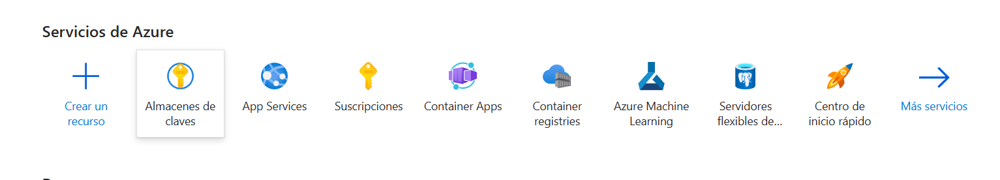
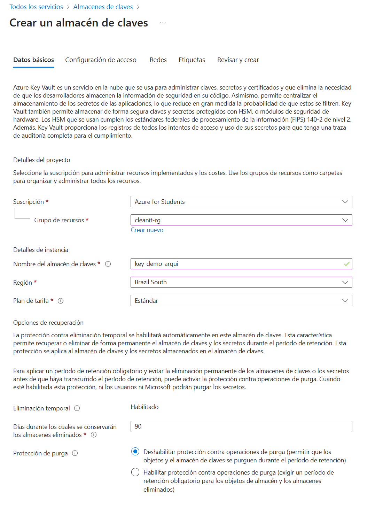
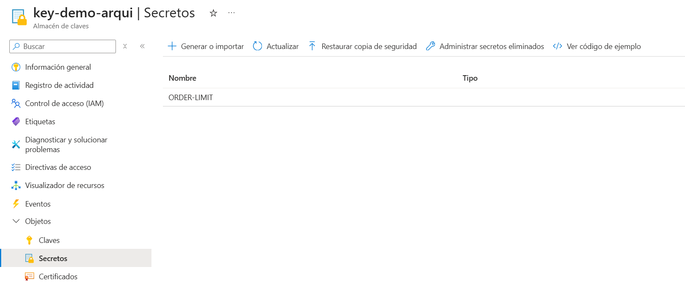
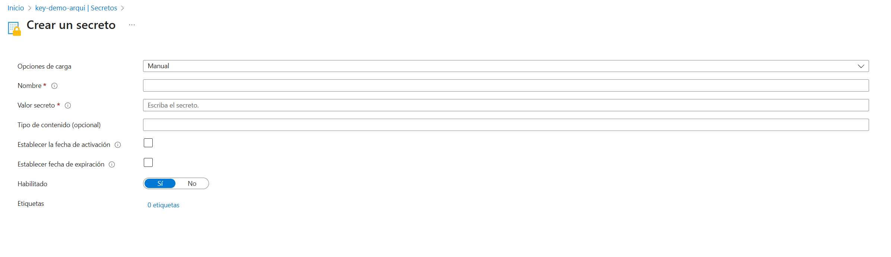

> [0. Acerca del Grupo](../../0.md) › [0.7. Trabajo Individual (Patrones Cloud)](../0.7.md) › [0.7.2. Integrante 2](0.7.2.md)

# 0.7.2. Integrante 2

# Trabajo: Implementación de Patrones Cloud — **External Configuration Store**

---

## 1) Problema

En entornos cloud, la configuración (conexiones, claves, toggles, URLs de servicios, reglas) **cambia por entorno** (dev/test/prod) y **evoluciona en el tiempo**. Si la dejamos **dentro del código** o de la **imagen Docker**:

- Requiere **recompilar y redeployar** cada cambio simple.
- Aumenta el **riesgo de filtrar secretos** (tokens, passwords) en el repositorio.
- Dificulta **auditar** y **versionar** cambios de configuración.
- Impide responder rápido ante incidentes (no hay **rollbacks** ni **feature toggles** dinámicos).

**Necesidad:** centralizar la configuración en un **almacén externo**, seguro, versionado y con **recarga** (dynamic reload) sin redeploy.

---

## 2) Solución (Patrón)

**External Configuration Store** propone **mover la configuración fuera de la app** (y del contenedor) hacia un **servicio dedicado** y **seguro**.  
La app **lee** su configuración al iniciar y/o **escucha cambios** para **refrescar** parámetros **sin reiniciar**.

### Building blocks (en Azure)
- **Azure App Configuration**: claves/valores, etiquetas por entorno (`dev`, `test`, `prod`), versionado, feature flags, notificaciones.
- **Azure Key Vault**: **secretos** (passwords, connection strings, certificados). Puede ser referenciado **desde App Configuration**.
- **Managed Identity**: la app se autentica **sin credenciales** (identity de Azure) para leer la configuración.

### Beneficios
- **Seguridad**: secretos fuera del repo; RBAC/Key Vault.
- **Operación ágil**: cambiar reglas/toggles **sin despliegue**.
- **Trazabilidad**: versionado + auditoría de cada cambio.
- **Paridad de entornos**: misma clave, distinta etiqueta.

---

## 3) Casos de aplicación (reales)

1. **Feature Toggles** (lanzamientos controlados): activar “Recepción Parcial V2” a un 10% de usuarios.
2. **Parámetros de negocio**: reglas de aprobación de **Órdenes de Compra** por monto/categoría.
3. **Integraciones**: URLs/timeout/retry de SMTP, facturación electrónica, laboratorio externo.
4. **Throttling**: límites de rate limit por ruta/entorno (horas pico).
5. **Mensajería**: colas/temas y políticas de reintentos configurables.
6. **Experimentos/AB**: textos, colores, flags de UI (en el Front).

---

## 4) Integración en **CliniSys** (Proyecto del curso)

### ¿Dónde aplica?
- **Módulo 2 — Compras**  
  - `compras.aprobacion.monto_max=5000`  
  - `compras.tolerancias.precio_pct=2`, `cantidad_pct=1`  
  - `compras.oc.envio_email.enabled=true`, `reintento_min=5`
- **Módulo 3 — Usuarios y Seguridad**  
  - `auth.password.min_length=10`, `lockout.attempts=5`, `token.ttl=3600`
- **Módulo 4 — Inventario**  
  - `inventario.alerta.stock_min=true`, `dias_vencimiento=30`
- **Integraciones**  
  - `smtp.host`, `smtp.timeout`, `facturacion.api_base`, `laboratorio.timeout`

### Cómo se verá en operación
1. Ops cambia `compras.aprobacion.monto_max` en **App Configuration** (`prod`).  
2. La **API** (NestJS) **refresca** el valor en caliente (cache TTL o push) → nuevas aprobaciones usan el nuevo monto **sin redeploy**.
3. Auditoría: queda el **registro** de quién cambió qué y cuándo.

---

## 5) Demo: Key Vault + API Node (Express) + Front React (Vite)
Caso real: una API que crea pedidos respetando un límite obtenido desde Azure Key Vault. Un front React consume la API y muestra el estado.
Puedes ver la video demo en el siguiente enlace -> [video demo](https://youtu.be/mQBUstdBWIM)
### 5.1) Preparación en Azure (Key Vault y Secreto)
- Inicia sesión en [Azure portal](https://portal.azure.com/)
- Crea un nuevo recurso "Almacenes de claves"

- Click en crear uno nuevo y configurar los parametros

- Al terminar de crear el recurso, puedes administrar y crear un nuevo secreto


- Desde tu terminal, inicia sesión en azure con el siguiente comando
```bash
az login
```

## 5.2) API en Node/Express (lógica de negocio)
Objetivo: exponer /status, /orders y /reset; la API lee ORDER_LIMIT desde Key Vault, lo cachea y limita la creación de pedidos.

#### Estructura y dependencias
```bash
mkdir -p key-vault-test/server && cd key-vault-test/server
npm init -y
npm i express @azure/identity @azure/keyvault-secrets dotenv cors
```

#### Variables de entorno (server/.env)
```js
PORT=3000
KEY_VAULT_NAME=<tu_kv_name>   # sin https ni .vault.azure.net
SECRET_NAME=ORDER_LIMIT
```

#### Código (server/index.js) – puntos clave:

- DefaultAzureCredential para autenticación.
- SecretClient para leer ORDER_LIMIT.
- Cache TTL (ej. 60s) para evitar leer KV en cada request.
- Estado en memoria para contar pedidos.
- CORS habilitado para el front.

```js
const { DefaultAzureCredential } = require("@azure/identity");
const { SecretClient } = require("@azure/keyvault-secrets");
const express = require("express");
require("dotenv").config();

const app = express();
const port = process.env.PORT || 3000;

const cors = require('cors');

app.use(cors({
  origin: 'http://localhost:5173',
  methods: ['GET', 'POST', 'PUT', 'PATCH', 'DELETE', 'OPTIONS'],
  allowedHeaders: ['Content-Type', 'Authorization'],
  credentials: false
}));

//app.options('*', cors());

// --- Azure Key Vault client ---
const credential = new DefaultAzureCredential();
const keyVaultName = (process.env.KEY_VAULT_NAME || "").trim();
if (!keyVaultName) throw new Error("KEY_VAULT_NAME is empty");
const url = `https://${keyVaultName}.vault.azure.net`;
const client = new SecretClient(url, credential);

// --- Cache simple del ORDER_LIMIT para no consultar Key Vault en cada request ---
const SECRET_NAME = process.env.SECRET_NAME || "ORDER_LIMIT";
let cachedLimit = null;
let lastFetch = 0;
const TTL_MS = 60_000; // refrescar cada 60s

async function getOrderLimit(force = false) {
  const now = Date.now();
  if (!force && cachedLimit !== null && now - lastFetch < TTL_MS) return cachedLimit;

  const sec = await client.getSecret(SECRET_NAME);
  cachedLimit = Number(String(sec.value || "0").trim());
  lastFetch = now;
  if (Number.isNaN(cachedLimit)) cachedLimit = 0;
  return cachedLimit;
}

// --- Estado en memoria para la demo ---
let ordersCount = 0;

// Health / ver secreto (solo DEMO)
app.get("/secret", async (_req, res) => {
  try {
    const sec = await client.getSecret(SECRET_NAME);
    res.json({ ok: true, name: sec.name, value: sec.value });
  } catch (e) {
    res.status(500).json({ ok: false, error: String(e) });
  }
});

// Estado actual (útil para el front)
app.get("/status", async (_req, res) => {
  try {
    const limit = await getOrderLimit();
    res.json({ ok: true, ordersCount, limit, remaining: Math.max(limit - ordersCount, 0) });
  } catch (e) {
    res.status(500).json({ ok: false, error: String(e) });
  }
});

// Endpoint que simula la creación de un pedido usando el ORDER_LIMIT del Key Vault
app.post("/orders", async (_req, res) => {
  try {
    const limit = await getOrderLimit();
    if (ordersCount >= limit) {
      return res.status(429).json({
        ok: false,
        message: `Se alcanzó el límite diario de pedidos (${limit}).`
      });
    }
    ordersCount += 1;
    const id = `ORD-${ordersCount.toString().padStart(4, "0")}`;
    return res.status(201).json({
      ok: true,
      id,
      used: ordersCount,
      limit,
      remaining: Math.max(limit - ordersCount, 0)
    });
  } catch (e) {
    res.status(500).json({ ok: false, error: String(e) });
  }
});

// Reset (solo para pruebas)
app.post("/reset", (_req, res) => {
  ordersCount = 0;
  res.json({ ok: true, ordersCount });
});

app.listen(port, () => console.log(`Server listening on http://localhost:${port}`));
```
## 5.3) Front React (Vite 5) — consumo de la API
### Crear proyecto
```bash
mkdir -p ../client && cd ../client
npm create vite@5 . -- --template react
npm i
```
### App mínima (client/src/App.jsx)
```js
import { useEffect, useState } from 'react';

const API = 'http://localhost:3000';

export default function App() {
  const [status, setStatus] = useState({ ok: false, ordersCount: -1, limit: -1, remaining: -1 });
  const [lastResult, setLastResult] = useState<{} | null>(null);
  const [loading, setLoading] = useState(false);

  const loadStatus = async () => {
    try {
      const r = await fetch(`${API}/status`);
      const data = await r.json();
      setStatus(data);
    } catch (e) {
      setStatus({ ok: false, ordersCount: -1, limit: -1, remaining: -1 });
    }
  };

  useEffect(() => { loadStatus(); }, []);

  const createOrder = async () => {
    setLoading(true);
    try {
      const r = await fetch(`${API}/orders`, { method: 'POST' });
      const data = await r.json();
      setLastResult(data);
      await loadStatus();
    } catch (e) {
      setLastResult({ ok: false, error: String(e), origin: 'create order' });
    } finally {
      setLoading(false);
    }
  };

  const reset = async () => {
    await fetch(`${API}/reset`, { method: 'POST' });
    setLastResult(null);
    await loadStatus();
  };

  return (
    <main style={{ padding: 24, fontFamily: 'system-ui, sans-serif', margin: 'auto' }}>
      <div style={{display: 'flex', flexDirection:'column', justifyContent: 'center'}}>
        <h1>Órdenes con límite (Key Vault)</h1>
        <p>La API aplica un límite diario leído desde Azure Key Vault.</p>

        <section style={{ background: 'black', padding: 12, borderRadius: 8 }}>
          <h3>Estado ok:{status.ok}</h3>
          <ul>
            <li><b>Usados:</b> {status.ordersCount}</li>
            <li><b>Límite:</b> {status.limit}</li>
            <li><b>Restantes:</b> {status.remaining}</li>
          </ul>
        </section>

        <div style={{ marginTop: 12, display: 'flex', gap: 12 }}>
          <button onClick={createOrder} disabled={loading} style={{ padding: '8px 14px' }}>
            {loading ? 'Creando…' : 'Crear pedido'}
          </button>
          <button onClick={reset} style={{ padding: '8px 14px' }}>Reset</button>
          <button onClick={loadStatus} style={{ padding: '8px 14px' }}>Refrescar</button>
        </div>

        {lastResult && (
          <section style={{ marginTop: 16, background: 'black', padding: 12, borderRadius: 8 }}>
            <h3>Resultado</h3>
            <pre style={{ whiteSpace: 'pre-wrap' }}>{JSON.stringify(lastResult, null, 2)}</pre>
          </section>
        )}

        <p style={{ color: '#666', marginTop: 16 }}>
          API: <code>{API}</code>
        </p>
      </div>

    </main>
  );
}
```
---

[⬅️ Anterior](../0.7.1/0.7.1.md) | [🏠 Home](../../../README.md) | [Siguiente ➡️](../0.7.3/0.7.3.md)