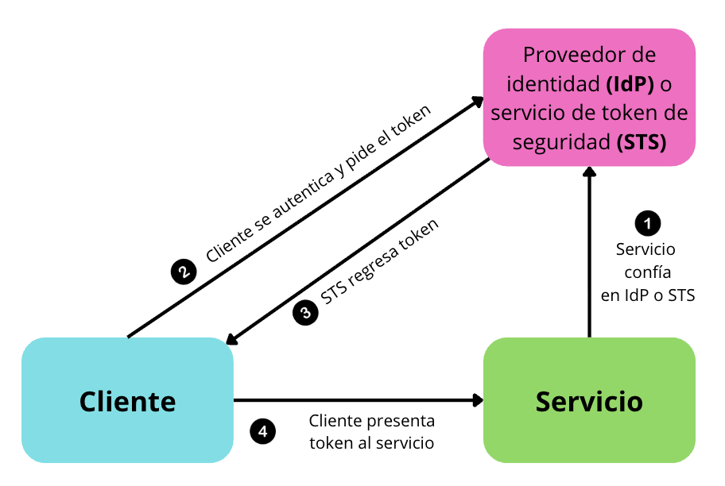

> [0. Acerca del Grupo](../../0.md) › [0.7. Trabajo Individual (Patrones Cloud)](../0.7.md) › [0.7.3. Integrante 3](0.7.3.md)

# 0.7.3. Integrante 3

## Federated Identity
---

## ¿Qué es?

Es un modelo en el cual la autenticación se delega a un **proveedor de identidad externo (IdP)**. En lugar de que la aplicación gestione directamente las credenciales del usuario, confía en ese proveedor para verificar su identidad, lo que simplifica el desarrollo, reduce la administración de usuarios y evita el manejo directo de contraseñas dentro de la aplicación.

## contexto y problema 

Los usuarios suelen trabajar con varias aplicaciones de distintas organizaciones, lo que implica manejar múltiples credenciales. Esto provoca diversos problemas:

- **Credenciales diferentes:** genera una mala experiencia de uso, ya que es común olvidar contraseñas.

- **Riesgos de seguridad:** algunas cuentas pueden permanecer activas cuando un usuario deja la empresa.

- **Mayor carga administrativa:** debido a la constante gestión y recuperación de credenciales.

En consecuencia, los usuarios prefieren utilizar una sola identidad para evitar estos inconvenientes.

## Solución 

La solución consiste en implementar un mecanismo de autenticación basado en el patrón Federated Identity, separando la autenticación del código de la aplicación y delegándola a un proveedor de **identidad de confianza (IdP)**. Este enfoque simplifica el desarrollo, reduce la carga administrativa y permite que los usuarios se autentiquen mediante distintos proveedores de identidad, manteniendo además una separación clara entre autenticación y autorización.

Los IdP pueden ser directorios corporativos, servicios de federación, STS empresariales o proveedores sociales como Microsoft, Google o Facebook. Su función es autenticar al usuario y emitir **tokens** de seguridad que contienen información sobre su identidad y, opcionalmente, sus roles o permisos.

En la siguiente imagen, se muestra cómo una aplicación cliente solicita acceso a un servicio protegido. En lugar de autenticarse directamente con dicho servicio, la aplicación redirige la autenticación al IdP (en conjunto con el STS). El IdP valida las credenciales y devuelve un token de seguridad, el cual la aplicación usa para acceder al servicio. De esta manera, el servicio confía en la autenticación emitida por el proveedor y no necesita gestionar credenciales propias.

## Casos de Aplicación:

Este patrón puede aplicarse en distintos contextos y tipos de organizaciones. Algunos casos representativos incluyen:

- En **empresas y entornos corporativos**, es común que los empleados utilicen múltiples aplicaciones internas como ERP, CRM, intranet, correo corporativo o sistemas de recursos humanos. Para evitar que cada sistema gestione credenciales de manera independiente, la organización puede implementar identidad federada mediante un proveedor corporativo como Azure AD, ADFS o Keycloak. De esta forma, la autenticación se centraliza y los usuarios inician sesión una sola vez con su cuenta institucional, mientras que las aplicaciones confían en el IdP sin almacenar ni validar contraseñas por separado.

- En **aplicaciones B2C y startups** que ofrecen login, como Uber, Spotify, Airbnb o apps móviles emergentes, la identidad federada permite delegar la autenticación a proveedores conocidos como Google, Apple o Facebook. Esta estrategia agiliza el registro y acceso, ya que el usuario no necesita crear nuevas credenciales, lo que mejora la experiencia, reduce el abandono al registrarse y minimiza los problemas de recuperación de contraseñas.

- En las **plataformas educativas de universidades y sistemas e-learning**, es habitual que estudiantes y docentes utilicen múltiples servicios digitales, como bibliotecas virtuales, el correo institucional, la intranet o herramientas externas como Google Workspace y Zoom. Para unificar el acceso, estas instituciones suelen implementar identidad federada y centralizar la autenticación mediante un IdP institucional. Esto permite administrar usuarios de manera centralizada y aplicar políticas coherentes a toda la comunidad académica, facilitando tanto el acceso como la seguridad. Además, cuando un alumno egresa o un docente deja la institución, su cuenta puede desactivarse automáticamente en todos los servicios, simplificando la gestión y evitando accesos indebidos.

---

[⬅️ Anterior](../0.7.2/0.7.2.md) | [🏠 Home](../../../README.md) | [Siguiente ➡️](../0.7.4/0.7.4.md)