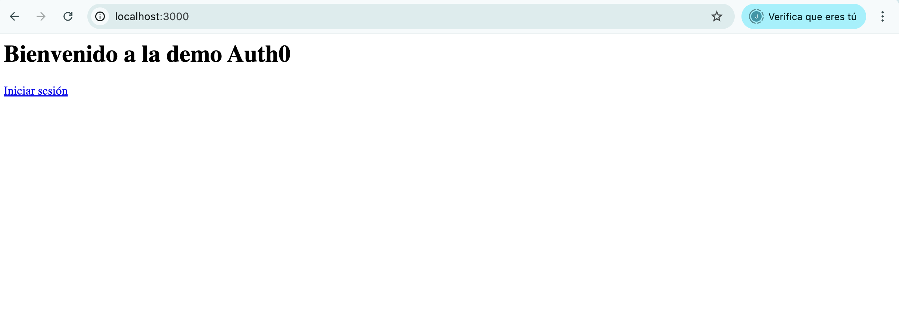
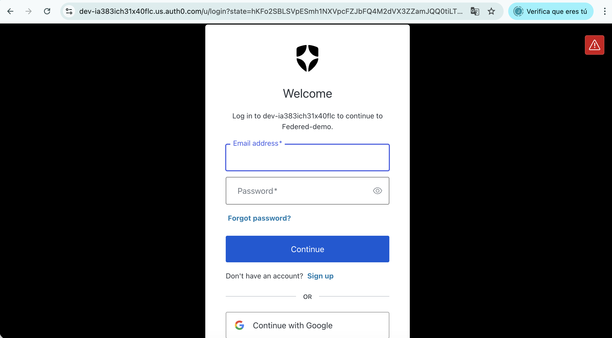
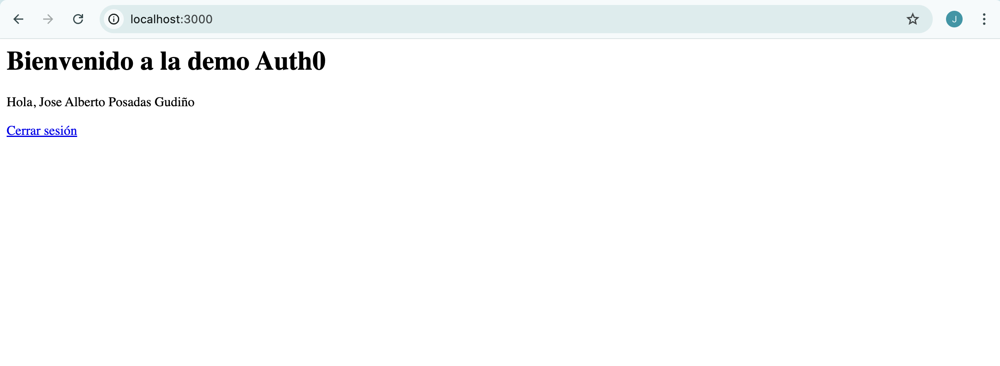

> [0. Acerca del Grupo](../../0.md) › [0.7. Trabajo Individual (Patrones Cloud)](../0.7.md) › [0.7.3. Integrante 3](0.7.3.md)

# 0.7.3. Integrante 3

## Federated Identity
---

## ¿Qué es?

Es un modelo en el cual la autenticación se delega a un **proveedor de identidad externo (IdP)**. En lugar de que la aplicación gestione directamente las credenciales del usuario, confía en ese proveedor para verificar su identidad, lo que simplifica el desarrollo, reduce la administración de usuarios y evita el manejo directo de contraseñas dentro de la aplicación.

## contexto y problema 

Los usuarios suelen trabajar con varias aplicaciones de distintas organizaciones, lo que implica manejar múltiples credenciales. Esto provoca diversos problemas:

- **Credenciales diferentes:** genera una mala experiencia de uso, ya que es común olvidar contraseñas.

- **Riesgos de seguridad:** algunas cuentas pueden permanecer activas cuando un usuario deja la empresa.

- **Mayor carga administrativa:** debido a la constante gestión y recuperación de credenciales.

En consecuencia, los usuarios prefieren utilizar una sola identidad para evitar estos inconvenientes.

## Solución 

La solución consiste en implementar un mecanismo de autenticación basado en el patrón Federated Identity, separando la autenticación del código de la aplicación y delegándola a un proveedor de **identidad de confianza (IdP)**. Este enfoque simplifica el desarrollo, reduce la carga administrativa y permite que los usuarios se autentiquen mediante distintos proveedores de identidad, manteniendo además una separación clara entre autenticación y autorización.

Su función es autenticar al usuario y emitir **tokens** de seguridad que contienen información sobre su identidad y, opcionalmente, sus roles o permisos.

En la siguiente imagen, se muestra cómo una aplicación cliente solicita acceso a un servicio protegido. En lugar de autenticarse directamente con dicho servicio, la aplicación redirige la autenticación al IdP (en conjunto con el STS). El IdP valida las credenciales y devuelve un token de seguridad, el cual la aplicación usa para acceder al servicio. De esta manera, el servicio confía en la autenticación emitida por el proveedor y no necesita gestionar credenciales propias.


## Casos de Aplicación:

Este patrón puede aplicarse en distintos contextos y tipos de organizaciones. Algunos casos representativos incluyen:

- En **empresas y entornos corporativos**, es común que los empleados utilicen múltiples aplicaciones internas como ERP, CRM, intranet, correo corporativo o sistemas de recursos humanos. Para evitar que cada sistema gestione credenciales de manera independiente, la organización puede implementar identidad federada mediante un proveedor corporativo como Azure AD, ADFS o Keycloak. De esta forma, la autenticación se centraliza y los usuarios inician sesión una sola vez con su cuenta institucional, mientras que las aplicaciones confían en el IdP sin almacenar ni validar contraseñas por separado.

- En **aplicaciones B2C y startups** que ofrecen login, como Uber, Spotify, Airbnb o apps móviles emergentes, la identidad federada permite delegar la autenticación a proveedores conocidos como Google, Apple o Facebook. Esta estrategia agiliza el registro y acceso, ya que el usuario no necesita crear nuevas credenciales, lo que mejora la experiencia, reduce el abandono al registrarse y minimiza los problemas de recuperación de contraseñas.

- En las **plataformas educativas de universidades y sistemas e-learning**, es habitual que estudiantes y docentes utilicen múltiples servicios digitales, como bibliotecas virtuales, el correo institucional, la intranet o herramientas externas como Google Workspace y Zoom. Para unificar el acceso, estas instituciones suelen implementar identidad federada y centralizar la autenticación mediante un IdP institucional. Esto permite administrar usuarios de manera centralizada y aplicar políticas coherentes a toda la comunidad académica, facilitando tanto el acceso como la seguridad. Además, cuando un alumno egresa o un docente deja la institución, su cuenta puede desactivarse automáticamente en todos los servicios, simplificando la gestión y evitando accesos indebidos.

## Aplicación en el proyecto grupal

En el **Módulo 3: Gestión de Usuarios y Seguridad** se implementará el patrón Federated Identity específicamente para el manejo de **usuarios externos**. Este patrón permitirá que dichos usuarios se autentiquen a través de proveedores de identidad externos como **Auth0**, evitando que el sistema gestione directamente sus credenciales y reduciendo la exposición de datos sensibles.

Por otro lado, los **usuarios internos** continuarán autenticándose mediante el mecanismo interno del ERP clínico. Esta separación mantiene la flexibilidad y control interno sobre el acceso del personal, sin comprometer la integración con servicios externos.

## Desarrollo de Código y Demo

La siguiente estructura muestra cómo se organiza la demo **auth0-login-demo**, siguiendo una arquitectura por capas (Dominio, Aplicación, Infraestructura y Presentación).

```bash
auth0-login-demo
├── src
│   ├── aplicacion
│   │   └── auth.service.js         # casos de uso
│   ├── dominio
│   │   └── user.entity.js          # Entidades
│   ├── infraestructura
        └── auth
            └── auth.config.js
│   │   └── server.js               # entrada servidor / config Auth0
│   └── presentacion
│       ├── controladores
│       │   └── auth.controller.js  # controladores HTTP
│       └── rutas
│           └── auth.routes.js      # rutas de autenticación
├── .env                            # variables de entorno
├── Dockerfile                      # imagen Docker
├── package.json                    # dependencias y scripts
```
--- 

### Requisitos Previos

- Node.js v18+
- Docker
- Cuenta en Auth0

---

### Codigo fuente 

En las siguientes secciones se detallan los archivos que conforman la demo, junto con el código implementado en cada uno de ellos.


### .env
El archivo **.env** contiene las variables de entorno para configurar la autenticación con Auth0 y definir el puerto donde se ejecuta la aplicación.
```bash
PORT=3000
AUTH0_SECRET=1p+nEQdYLM48/LiPBmUDvZ9T7YqPMgBhw2H+pzunME8=
AUTH0_BASE_URL=http://localhost:3000
AUTH0_ISSUER_BASE_URL=https://dev-ia383ich31x40flc.us.auth0.com
AUTH0_CLIENT_ID=2oaCbFgzzugjrTelfmF5E4LjNr95BSuz
AUTH0_CLIENT_SECRET=Z8GP-2zPsn8GQwaXq6ZaL5PILdmSbz1wwf2X77sz93-BOQ38AGJMLBc3nZ0rFzUU
```

### auth.service.js

Este archivo pertenece a la capa de **aplicación**. Su función principal es transformar los datos del usuario autenticado por Auth0 en una entidad del dominio (User), que luego puede ser utilizada por otras capas del sistema.

```bash
import { User } from "../dominio/user.entity.js";

export class AuthService {
  static getUserInfo(oidcUser) {
    if (!oidcUser) return null;
    return new User({ name: oidcUser.name, email: oidcUser.email });
  }
}
```

### user.entity.js

Este archivo pertenece a la capa de **dominio** y define la entidad principal del proceso de autenticación, el cual es usuario. 
```bash
export class User {
  constructor({ name, email }) {
    this.name = name;
    this.email = email;
  }
}

```

### auth.config.js

Forma parte de la capa de **infraestructura** y define la configuración de autenticación con Auth0.
Su función es centralizar las credenciales y parámetros necesarios para conectar la aplicación con el proveedor de identidad Auth0.

```bash
import { auth } from "express-openid-connect";
import dotenv from "dotenv";

dotenv.config();

export const authConfig = {
  authRequired: false,
  auth0Logout: true,
  secret: process.env.AUTH0_SECRET,
  baseURL: process.env.AUTH0_BASE_URL,
  clientID: process.env.AUTH0_CLIENT_ID,
  issuerBaseURL: process.env.AUTH0_ISSUER_BASE_URL,
};

export const authMiddleware = auth(authConfig);

```

**server.js**
Este archivo es el punto de entrada principal del servidor y pertenece **infraestructura**.
Su función es inicializar la aplicación Express, configurar el middleware de autenticación de Auth0 y registrar las rutas definidas en la capa de presentación.

```bash
import express from "express";
import { authMiddleware } from "./auth/auth.config.js";
import authRoutes from "../presentacion/rutas/auth.routes.js";
import dotenv from "dotenv";

dotenv.config();

const app = express();

// Middleware de autenticación Auth0
app.use(authMiddleware);

// Rutas
app.use("/", authRoutes);

// Inicio del servidor
const PORT = process.env.PORT || 3000;
app.listen(PORT, () => {
  console.log(`Servidor en marcha en ${process.env.AUTH0_BASE_URL}`);
});

```
## auth.controller.js

Este pertenece a la capa de **presentación**.
Su propósito es manejar las solicitudes HTTP relacionadas con la autenticación, interactuando con la capa de aplicación para obtener la información del usuario autenticado y mostrar lo necesario en la interfaz.

```bash
import { AuthService } from "../../aplicacion/auth.service.js";

export class AuthController {
  static home(req, res) {
    const user = AuthService.getUserInfo(req.oidc.user);

    res.send(`
      <h1>Bienvenido a la demo Auth0</h1>
      ${req.oidc.isAuthenticated()
        ? `<p>Hola, ${user.name}</p><p><a href="/logout">Cerrar sesión</a></p>`
        : `<p><a href="/login">Iniciar sesión</a></p>`}
    `);
  }
}

```

### auth.routes.js

Pertenece a la capa de **presentación**.
Su función es definir las rutas HTTP relacionadas con la autenticación y vincularlas con los controladores correspondientes.

```bash
import express from "express";
import { AuthController } from "../controladores/auth.controller.js";

const router = express.Router();

router.get("/", AuthController.home);

export default router;

```

### Dockerfile
Este archivo define la imagen Docker para levantar el proyecto, con el se crea el contenedor para ejecutar la aplicación Node.js con Auth0.

```bash
# Imagen base
FROM node:18

# Crear directorio de trabajo dentro del contenedor
WORKDIR /app

# Copiar los archivos del proyecto
COPY package*.json ./
RUN npm install

COPY . .

# Exponer puerto
EXPOSE 3000

# Comando de arranque
CMD ["npm", "start"]
```
### package.json
Este archivo define las dependencias, los scripts de ejecución y la configuración básica del proyecto Node.js.

```bash
{
  "type": "module",
  "name": "auth0-login-demo",
  "version": "1.0.0",
  "description": "",
  "scripts": {
    "start": "node src/infraestructura/server.js"
  },
  "keywords": [],
  "author": "",
  "license": "ISC",
  "dependencies": {
    "dotenv": "^17.2.3",
    "express": "^5.1.0",
    "express-openid-connect": "^2.19.2"
  }
}
```

---

## Demo

Se detalla a continuación la secuencia de pasos necesaria para la ejecución de la demo:

### Ejecutar la demo

1. Clonar el repositorio:
```bash
git clone [URL]
```

2. Navegar hasta la carpeta del proyecto (esta carpeta):
```bash
cd [carpeta]
```

3. Levantar todos los servicios con Docker Compose:
```bash
docker compose up
```

4. Ingresar a la pagina web en:
```bash
http://localhost:3000
```

5. Presionar el botón “Iniciar sesión”.



6. Autenticarse utilizando alguna de las opciones que ofrece Auth0.



7. Al iniciar sesión correctamente, se muestra la pantalla principal con el nombre del perfil del usuario autenticado.




---

[⬅️ Anterior](../0.7.2/0.7.2.md) | [🏠 Home](../../../README.md) | [Siguiente ➡️](../0.7.4/0.7.4.md)