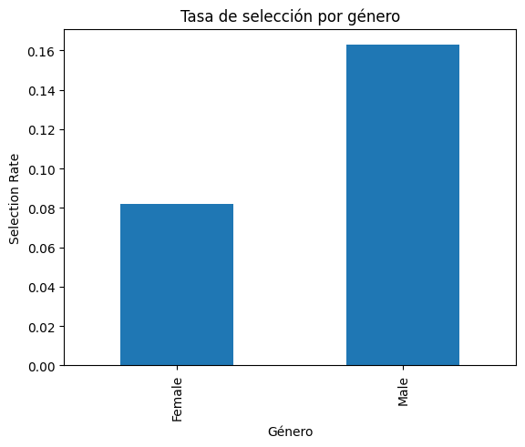

> [0. Acerca del Grupo](../../0.md) › [0.8. Temas Individuales (Parte 2)](../0.8.md) › [0.8.2. Integrante 2](0.8.2.md)

# 0.8.2. Integrante 2

# Detección de Sesgos en Modelos de IA  
---

## Desarrollo conceptual

### ¿Qué es y por qué importa?

La **detección de sesgos en modelos de IA** consiste en identificar diferencias injustificadas en el comportamiento de un modelo hacia distintos **grupos sensibles**, tales como género, edad, raza o país.  
Incluso cuando un modelo tiene alta precisión, puede seguir siendo **discriminatorio**, porque los datos con los que se entrena reflejan desigualdades históricas o desbalances.

Herramientas como **Fairlearn** y **IBM Fairness360** permiten:

- medir equidad entre grupos,
- auditar decisiones del modelo,
- generar métricas de sesgo,
- y aplicar técnicas de mitigación para mejorar la justicia del sistema.

La detección temprana de sesgos es clave para diseñar **IA Responsable**.

---

## Consideraciones técnicas

### Herramientas elegidas y por qué

* **Fairlearn**  
  Biblioteca abierta para medir y mitigar sesgos.  
  Facilita el cálculo de métricas de equidad como *selection rate* y *demographic parity difference*.  
  Ideal para análisis rápido y reproducible en entornos de notebooks.

* **scikit-learn**  
  Framework estándar para entrenar modelos de clasificación y regresión.  
  Se usa el modelo **Logistic Regression** como base, ampliamente utilizado en problemas de clasificación.

* **Dataset Adult (UCI Machine Learning Repository)**  
  Dataset clásico para análisis de sesgo, contiene variables sensibles como **sexo** y **raza**, además de atributos socioeconómicos reales.  
  Es un buen caso para demostrar cómo un modelo puede repetir sesgos históricos.

---

## Demo

### 🎯 Objetivo de la demo

Mostrar cómo un modelo de machine learning aparentemente “preciso” puede presentar **sesgos de género**, y cómo herramientas como **Fairlearn** permiten detectarlo mediante métricas y visualizaciones.

---

### 🧪 Paso a paso

### 1. Crear y activar un entorno virtual (venv)

```bash
python -m venv venv
```

**Windows (CMD):**
```bash
venv\Scripts\activate.bat
```

---

### 2. Instalar dependencias

```bash
pip install pandas seaborn matplotlib scikit-learn fairlearn jupyter ipykernel
```

---

### 3. Descargar el dataset Adult

Guardar el archivo `adult.data` dentro de:

```
dataset/adult.data
```

---

### 4. Cargar el dataset desde el notebook

```python
import pandas as pd

columns = ["age","workclass","fnlwgt","education","education_num","marital_status",
           "occupation","relationship","race","sex","capital_gain",
           "capital_loss","hours_per_week","native_country","income"]

df = pd.read_csv("dataset/adult.data", header=None, names=columns,
                 na_values=" ?", skipinitialspace=True)

df.head()
```

---

### 5. EDA – Exploración de datos

```python
df.info()
df["income"].value_counts(normalize=True)
df["sex"].value_counts(normalize=True)
```

Visualización:

```python
import seaborn as sns
import matplotlib.pyplot as plt

sns.countplot(x="sex", hue="income", data=df)
plt.title("Ingresos por género")
plt.show()
```

---

### 6. Preparación de variables

```python
from sklearn.model_selection import train_test_split

y = (df["income"].str.contains(">50K")).astype(int)
A = df["sex"]  # atributo sensible

X = df[["age","education_num","capital_gain","capital_loss","hours_per_week"]]

X_train, X_test, y_train, y_test, A_train, A_test = train_test_split(
    X, y, A, test_size=0.3, random_random_state=42)
```

---

### 7. Entrenamiento del modelo

```python
from sklearn.linear_model import LogisticRegression
from sklearn.metrics import accuracy_score

model = LogisticRegression(max_iter=2000).fit(X_train, y_train)
preds = model.predict(X_test)

accuracy_score(y_test, preds)
```

---

### 8. Análisis de sesgos con Fairlearn

```python
from fairlearn.metrics import MetricFrame, selection_rate, demographic_parity_difference

mf = MetricFrame(
    metrics=selection_rate,
    y_true=y_test,
    y_pred=preds,
    sensitive_features=A_test
)

mf.by_group
```

---

### 9. Métrica de injusticia: Demographic Parity Difference

```python
dpd = demographic_parity_difference(y_test, preds, sensitive_features=A_test)
dpd
```

---

### 10. Visualización

```python
mf.by_group.plot(kind="bar", title="Tasa de selección por género")
plt.show()
```

---

# Conclusiones

* El modelo presenta **sesgo de género**, clasificando a los hombres con el doble de probabilidad de pertenecer al grupo de ingresos altos.
* Esto ocurre porque los datos originales contienen desbalances históricos.  
* La precisión no es suficiente; se debe medir equidad explícitamente.
* Fairlearn permite cuantificar y visualizar estos sesgos.
* Es fundamental incluir estas evaluaciones en procesos de **IA Responsable**.

---
# Video demo

**Youtube video**: https://www.youtube.com/watch?v=iuWloGv2gOE
---
## Navegación del entregable

[⬅️ Anterior](../0.8.1/0.8.1.md) | [🏠 Home](../../../README.md) | [Siguiente ➡️](../0.8.3/0.8.3.md)
