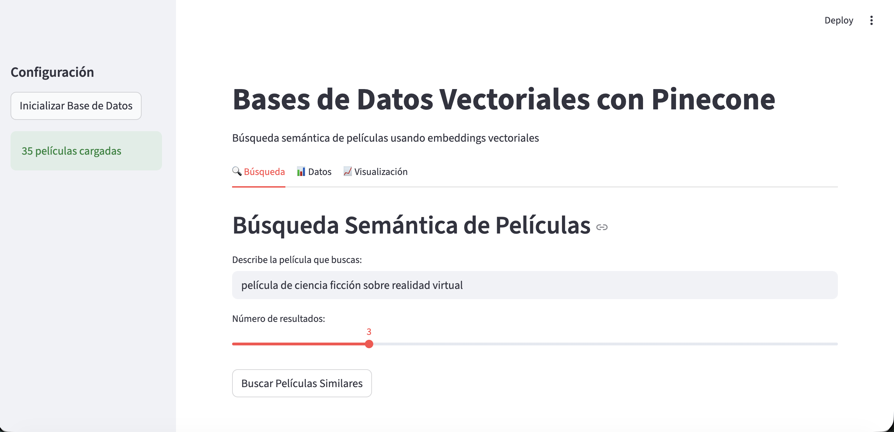
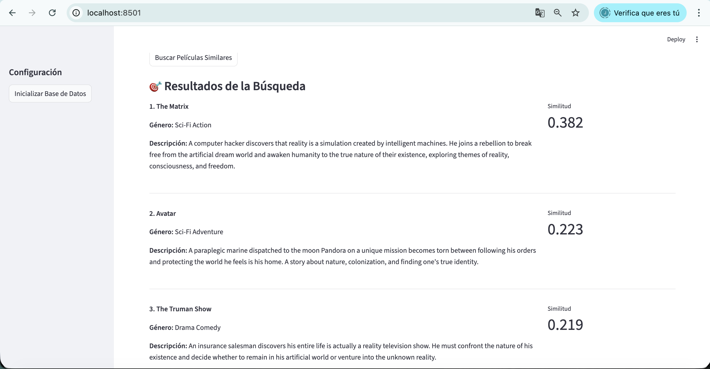
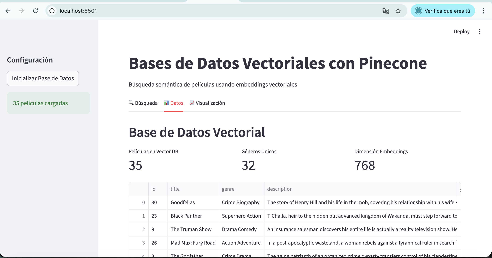
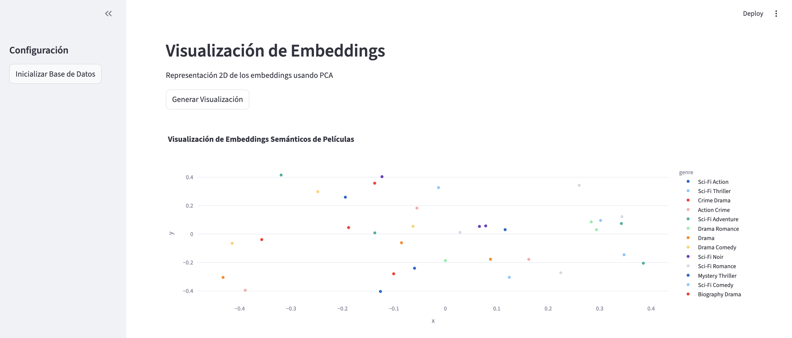

> [0. Acerca del Grupo](../../0.md) › [0.8. Temas Individuales (Parte 2)](../0.8.md) › [0.8.3. Integrante 3](0.8.3.md)

# 0.8.3. Integrante 3

# Bases de Datos Vectoriales
## 1. Desarrollo conceptual 

### ¿Qué es una base de datos vectorial?

Una **base de datos vectorial** es un sistema diseñado para almacenar, indexar y consultar vectores o representaciones numéricas de datos como texto, imágenes, audio o video.

Estos vectores suelen ser generados por modelos de machine learning (por ejemplo, modelos de embeddings) que convierten el contenido en listas de números donde la distancia matemática entre vectores indica similitud semántica.

### ¿Por qué se necesitan?

Los datos actuales son principalmente no estructurados: documentos, imágenes, audios, videos, logs, mensajes, código, etc. En este tipo de datos, la representación tradicional (texto literal) es limitada para encontrar similitudes, por ejemplo:

- “auto” y “carro” son palabras distintas pero significan lo mismo.

- Una imagen de un gato no comparte texto con otra imagen de gato.

Los embeddings resuelven esto al convertir cada elemento en un vector donde significados similares terminan cercanos entre sí.

Las bases vectoriales permiten consultas del tipo:

- “Encuentra documentos similares a este párrafo.”

- “Devuélveme imágenes parecidas a esta imagen.”

- “¿Qué código es parecido a este snippet?”

- “Qué cliente tiene un comportamiento similar al actual?”

### Capacidades principales
En lugar de buscar coincidencias exactas como en SQL, las bases vectoriales permiten:

**1. Búsqueda por similitud (similarity search)**

Encuentra los elementos más cercanos a un vector de consulta usando métricas como:

- Cosine similarity
- Euclidean distance
- Dot product

Esto se usa en buscadores semánticos, recomendaciones y clasificación.

**2. Recuperación semántica (semantic search)**

A diferencia de un buscador tradicional, identifica resultados relevantes aunque no contengan las mismas palabras, basándose en significado.

**Ejemplo:**
    
**Consulta:**```“¿Cómo enciendo la PC?”```

**Resultado relevante:**``` “Pasos para iniciar un computador”```

**3. RAG (Retrieval Augmented Generation)**

Combina bases vectoriales con modelos generativos (LLMs).
La base vectorial recupera la información relevante con la cual el modelo genera respuestas precisas, actualizadas y con base en hechos.

Es la técnica estándar para:
- Chatbots empresariales
- Sistemas de preguntas y respuestas
- Asistentes conversacionales con conocimiento específico
- Análisis e indexación de documentos

**4. Clasificación y clustering basados en embeddings**

Agrupa o clasifica elementos según su posición en el espacio vectorial. Muy útil en:

- Clusterización de noticias o clientes
- Detección de temas
- Segmentación inteligente

**5. Recomendación de contenido similar**

Motores de recomendación basados en similitud semántica:
- Productos parecidos
- Películas similares
- Artículos relacionados
- Usuarios con comportamientos parecidos

### Ventajas

Ofrecen múltiples ventajas que las convierten en la solución ideal para trabajar con datos no estructurados y sistemas de IA modernos. Su arquitectura está diseñada para escalar eficientemente, permitiendo manejar desde millones hasta miles de millones de vectores sin comprometer el rendimiento.

Además, incorporan técnicas avanzadas de indexación de alta velocidad (como HNSW, IVF o Product Quantization) que optimizan la búsqueda y reducen significativamente los tiempos de consulta en espacios de alta dimensión. 

Otra ventaja clave es su integración natural con modelos de IA generativa y LLMs, ya que utilizan embeddings como representación semántica unificada de cualquier tipo de contenido. Todo esto se combina para ofrecer alta precisión en búsquedas semánticas, incluso en datos complejos o no estructurados como texto libre, imágenes o audio.

### **Diagrama conceptual** (visualización del proceso)

Esquema que resume cómo se organiza y consulta la información en un entorno vectorial


## 2. Consideraciones técnicas

Para este proyecto, las consideraciones técnicas se centran en el uso de:

### 1. Pinecone como base de datos vectorial

**Pinecone** ofrece:

- Indexación optimizada para búsquedas vectoriales de alta velocidad.

- Almacenamiento administrado y escalable.

- API simple para insertar, actualizar y consultar vectores.


### 2. Python como lenguaje principal**

**Python** será usado para:

- Generar embeddings.

- Insertar vectores en Pinecone.

- Ejecutar consultas de similitud y procesar resultados.

### 3. Docker como entorno aislado de ejecución

Se usa **Docker** para garantizar portabilidad y reproducibilidad:

- Ventajas del uso de Docker:
    - Paquetes y dependencias controladas.
    Ambiente consistente entre desarrollo y producción.
    Posibilidad de contenedores dedicados para Python + SDK de Pinecone.

- Componentes principales del contenedor Docker:
    - Python 
    - Dependencias: pinecone-client, librerías de embeddings

### Requisitos previos
- Una cuenta en Pinecone.
- Variable de entorno PINECONE_API_KEY configurada en un archivo .env.

Ejemplo de .env:

```bash
PINECONE_API_KEY=tu_api_key_aqui
```


## 3. Demo 

Esta demo muestra cómo construir un sistema de búsqueda semántica usando Pinecone (Vector DB), embeddings y una interfaz visual con Streamlit.
Permite cargar un dataset de películas, generar embeddings, almacenarlos en Pinecone y realizar búsquedas inteligentes basadas en significado, no en coincidencia literal.
El proyecto se ejecuta completamente dentro de un contenedor Docker, garantizando portabilidad y facilidad de despliegue.

### Código

---
### Archivo app.py

**1. Configuración Inicial y Carga de la Demo**

Este bloque configura Streamlit, la página y carga la clase principal MovieVectorDemo usando caché para evitar recargar todo cada vez.

```python
import streamlit as st
import pandas as pd
from movie_recommender import MovieVectorDemo

# Configurar página
st.set_page_config(
    page_title="Demo Pinecone - Búsqueda Vectorial",
    page_icon="🎬",
    layout="wide"
)

# Inicializar demo
@st.cache_resource
def init_demo():
    return MovieVectorDemo()

demo = init_demo()
```

**2. Sidebar — Inicialización Manual de la Base Vectorial**

Permite cargar por primera vez los datos a Pinecone.
Solo debe usarse cuando la base está vacía o se quiere regenerar todo.

```python
# Sidebar
st.sidebar.header("Configuración")

if st.sidebar.button("Inicializar Base de Datos"):
    with st.spinner("Subiendo datos a Pinecone..."):
        try:
            count = demo.upload_to_pinecone()
            st.sidebar.success(f"{count} películas cargadas")
            st.cache_data.clear()   # Limpia cache para forzar recarga
        except Exception as e:
            st.sidebar.error(f"Error: {str(e)}")
```



**3. Pestaña “Búsqueda Semántica”**

Este bloque recibe un texto en lenguaje natural, genera embeddings y consulta Pinecone para mostrar películas similares.

```python
tab1, tab2, tab3 = st.tabs(["🔍 Búsqueda", "📊 Datos", "📈 Visualización"])

with tab1:
    st.header("Búsqueda Semántica de Películas")

    query = st.text_input(
        "Describe la película que buscas:",
        "película de ciencia ficción sobre realidad virtual"
    )

    top_k = st.slider("Número de resultados:", 1, 10, 3)

    if st.button("Buscar Películas Similares"):
        with st.spinner("Buscando en la base vectorial..."):
            try:
                results = demo.search_similar_movies(query, top_k=top_k)

                st.subheader("🎯 Resultados de la Búsqueda")
                for i, match in enumerate(results['matches']):
                    score = match['score']
                    metadata = match['metadata']

                    col1, col2 = st.columns([3, 1])
                    with col1:
                        st.write(f"**{i+1}. {metadata['title']}**")
                        st.write(f"**Género:** {metadata['genre']}")
                        st.write(f"**Descripción:** {metadata['description']}")
                    with col2:
                        st.metric("Similitud", f"{score:.3f}")

                    st.divider()

            except Exception as e:
                st.error(f"Error en la búsqueda: {str(e)}")
```



**4. Pestaña “Datos”**

Muestra las películas almacenadas en Pinecone y estadísticas rápidas.

```python
with tab2:
    st.header("Base de Datos Vectorial")

    @st.cache_data
    def load_pinecone_data():
        try:
            return demo.get_all_movies_from_pinecone()
        except Exception as e:
            st.error(f"Error cargando desde Pinecone: {str(e)}")
            return pd.DataFrame()

    pinecone_df = load_pinecone_data()

    if not pinecone_df.empty:
        col1, col2, col3 = st.columns(3)
        with col1:
            st.metric("Películas en Vector DB", len(pinecone_df))
        with col2:
            st.metric("Géneros Únicos", pinecone_df['genre'].nunique())
        with col3:
            st.metric("Dimensión Embeddings", 768)

        st.dataframe(pinecone_df, use_container_width=True)

        if st.button("Actualizar Datos"):
            st.cache_data.clear()
            st.rerun()
    else:
        st.error("No se pudieron cargar los datos desde Pinecone")
        st.info("💡 Asegúrate de haber inicializado la base de datos primero")
```




**5. Pestaña “Visualización de Embeddings”**

```python
Reduce los vectores vía PCA para dibujar un gráfico 2D interactivo.

with tab3:
    st.header("Visualización de Embeddings")
    st.markdown("Representación 2D de los embeddings usando PCA")

    if st.button("Generar Visualización"):
        with st.spinner("Calculando visualización..."):
            try:
                fig = demo.visualize_embeddings()
                st.plotly_chart(fig, use_container_width=True)
            except Exception as e:
                st.error(f"Error en visualización: {str(e)}")
```



### Archivo config.py
El archivo config.py centraliza toda la configuración necesaria para conectarse a Pinecone, gestionar las variables de entorno y obtener/crear un índice vectorial.

**1. Carga de dependencias y variables de entorno**

Este bloque importa las librerías necesarias y carga automáticamente el archivo .env que contiene la API key.

- dotenv permite usar variables como PINECONE_API_KEY.
- Evita exponer credenciales en el código.
```python
import os
import time
from pinecone import Pinecone, ServerlessSpec
from dotenv import load_dotenv

load_dotenv()
```

**2. Clase PineconeConfig – Inicialización de Pinecone**

Esta clase encapsula toda la lógica de conexión con Pinecone.

- Obtiene la API Key desde .env.
- Valida que exista.
- Crea el cliente oficial de Pinecone (Pinecone()).
Esto garantiza que cualquier módulo del proyecto pueda conectarse sin reescribir código.
```python
class PineconeConfig:
    def __init__(self):
        self.api_key = os.getenv('PINECONE_API_KEY')
        if not self.api_key:
            raise ValueError("PINECONE_API_KEY no encontrada en variables de entorno")
        
        self.pc = Pinecone(api_key=self.api_key)
        print("Pinecone configurado correctamente")

```

**3. Método get_index() — (Crear o recuperar un índice)**

Este método administra el índice vectorial donde se almacenan las películas.

```py
def get_index(self, index_name, dimension=384, metric='cosine', force_recreate=False):
    """Obtener o crear índice de Pinecone"""
    try:
        # Listar índices existentes
        existing_indexes = self.pc.list_indexes()
        index_names = [index.name for index in existing_indexes]
        
        print(f"Índices existentes: {index_names}")
        
        if index_name not in index_names:
            print(f"Creando nuevo índice: {index_name} con dimensión {dimension}")
            self.pc.create_index(
                name=index_name,
                dimension=dimension,
                metric=metric,
                spec=ServerlessSpec(
                    cloud='aws',
                    region='us-east-1'
                )
            )
            print("Esperando a que el índice esté listo...")
            time.sleep(10)
            print("Índice creado y listo")
        else:
            print(f"Usando índice existente: {index_name}")
        
        return self.pc.Index(index_name)
        
    except Exception as e:
        print(f"Error al obtener índice: {e}")
        raise
```

### Archivo movie_recommender.py 

Este archivo contiene la clase principal MovieVectorDemo, responsable de:
- cargar los datos de películas
- generar embeddings semánticos
- subirlos a Pinecone
- realizar búsquedas vectoriales
- extraer datos para visualizaciones
- consultar Pinecone

**1. Inicialización de la clase**
Crea el cliente de Pinecone usando PineconeConfig().
- Define el nombre del índice.
- Prepara variables internas para:
    - el dataframe de películas
    el modelo de embeddings

```python
class MovieVectorDemo:
    def __init__(self):
        try:
            self.config = PineconeConfig()
            self.index_name = "movie-demo-semantic"
            self.movies_df = None
            self.embedding_model = None
            print("MovieVectorDemo inicializado correctamente")
        except Exception as e:
            print(f"Error al inicializar MovieVectorDemo: {e}")
            raise
```

**2. Cargar los datos desde CSV**
Carga el archivo movies.csv dentro del contenedor Docker.
- Asigna el contenido a self.movies_df.
- Este método debe ejecutarse siempre antes de generar embeddings.

```python
def load_sample_data(self):
    
    csv_path = "/app/data/movies.csv"
    self.movies_df = pd.read_csv(csv_path)
    print(f"{len(self.movies_df)} películas cargadas desde CSV")
```

**3. Carga del modelo de embeddings**
- Carga un modelo SOTA de SentenceTransformers (all-mpnet-base-v2).
    -   Se utiliza para convertir películas y consultas en vectores.

```python
def initialize_embedding_model(self):
    from sentence_transformers import SentenceTransformer
    self.embedding_model = SentenceTransformer('all-mpnet-base-v2')
```

**4. Generación de embeddings**
- Combina título + género + descripción + keywords en un solo texto.
- Genera embeddings de manera vectorizada.
- Retorna un array (N, D) donde N es cantidad de películas y D es la dimensión del embedding.

```python
def create_embeddings(self):
    if self.movies_df is None:
        self.load_sample_data()
    if self.embedding_model is None:
        self.initialize_embedding_model()

    combined_text = []
    for _, movie in self.movies_df.iterrows():
        text = f"{movie['title']}. {movie['genre']}. {movie['description']}"
        if 'keywords' in movie and pd.notna(movie['keywords']):
            text += f". {movie['keywords']}"
        combined_text.append(text)

    embeddings = self.embedding_model.encode(combined_text)
    print(f"Embeddings semánticos creados: {embeddings.shape}")
    return embeddings
```

**5. Subir los vectores a Pinecone**
- Genera embeddings.
- Obtiene la dimensión real del modelo (importante para Pinecone).
- Recrea el índice desde cero si force_recreate=True.
- Prepara cada película en formato que reconozca pinecone y luego los inserta.

```python
def upload_to_pinecone(self):
    embeddings = self.create_embeddings()
    actual_dimension = embeddings.shape[1]

    index = self.config.get_index(
        self.index_name,
        dimension=actual_dimension,
        force_recreate=True
    )
```

**6. Búsqueda semántica** 
- Convierte el texto de búsqueda en un embedding.
- Consulta Pinecone usando similitud coseno.
- Retorna los top_k resultados con metadatos.

```python
def search_similar_movies(self, query, top_k=3):
    if self.embedding_model is None:
        self.initialize_embedding_model()

    query_embedding = self.embedding_model.encode([query])[0]

    results = index.query(
        vector=query_embedding.tolist(),
        top_k=top_k,
        include_metadata=True
    )
    return results
```

**7. Visualización de embeddings**

Reduce los embeddings de N dimensiones → 2D usando PCA.
- Crea un scatter plot interactivo con Plotly.
- Colorea por género y muestra hover con títulos.

```python
def visualize_embeddings(self):
    embeddings = self.create_embeddings()
    pca = PCA(n_components=2)
    embeddings_2d = pca.fit_transform(embeddings)
```

**8. Obtener todo el contenido del índice**

- Usa un vector cero para recuperar todos los elementos del índice.
- Convierte los resultados a un DataFrame.
- Se usa para la pestaña “Datos” en Streamlit.

```python
def get_all_movies_from_pinecone(self):
    zero_vector = [0] * actual_dimension

    results = index.query(
        vector=zero_vector,
        top_k=10000,
        include_metadata=True
    )
```

**9. Obtener el conteo de películas**
- Devuelve cuántos vectores hay actualmente en Pinecone.

```python
def get_movies_count(self):
    stats = index.describe_index_stats()
    return stats.total_vector_count
```


### Cómo ejecutar la demo
1. Ubícate en el directorio raíz del proyecto.

2. Levanta el contenedor utilizando Docker.

```
docker compose up --build
```
3. Entrar en el link:

```
http://localhost:8501/
```

### Link Video:

https://youtu.be/W2bA0UmyjrI


---

[⬅️ Anterior](../0.8.2/0.8.2.md) | [🏠 Home](../../../README.md) | [Siguiente ➡️](../0.8.4/0.8.4.md)