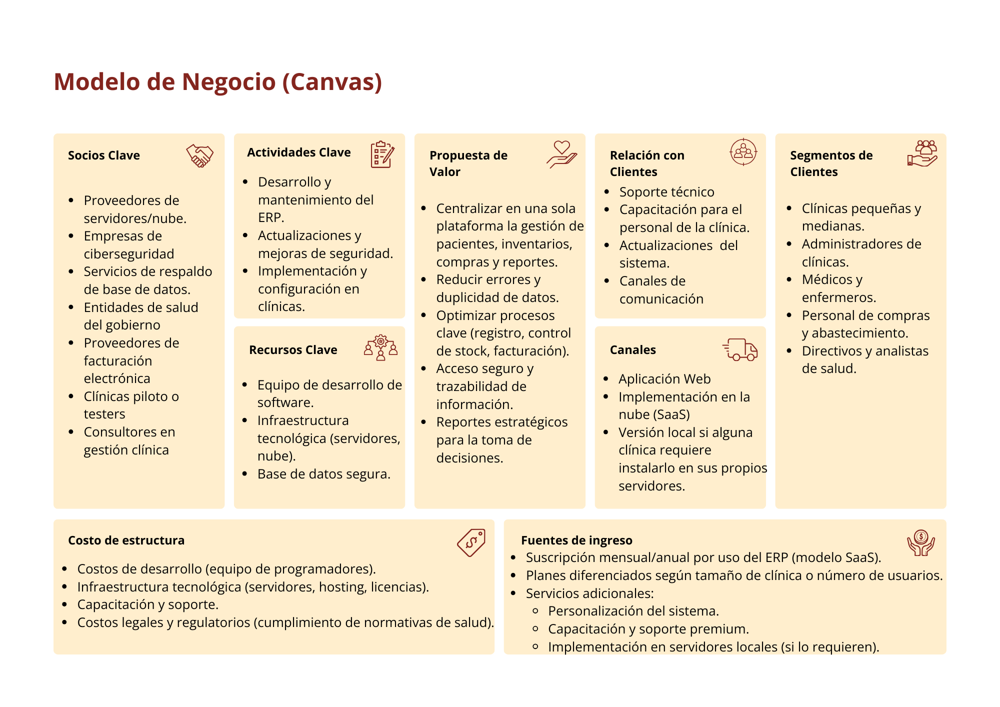

# 1.2. Modelo de Negocio

## Tipo de modelo

Un SaaS (Software como Servicio), donde las clínicas acceden al ERP a través de la nube pagando una suscripción.

## Posibles modelos de ingreso

- **Suscripción mensual o anual** (modelo principal)

    -  **Plan básico:** número limitado de pacientes, usuarios y módulos.

    - **Plan intermedio:** acceso a todos los módulos, más usuarios y reportes avanzados.

    - **Plan premium:** personalización, soporte prioritario, mayor capacidad de almacenamiento.

- **Implementación local**
    - Para clínicas que no quieren la nube (pago único de licencia + mantenimiento anual).

- **Servicios adicionales**
    - Capacitación al personal de la clínica.
    - Desarrollo de módulos personalizados.

# Canvas
A continuación se muestra el desarrollo del modelo de negocio:

