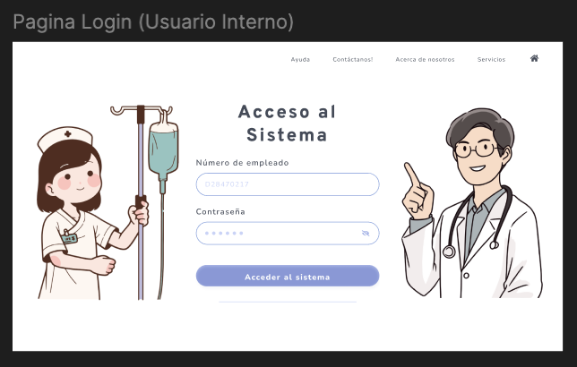
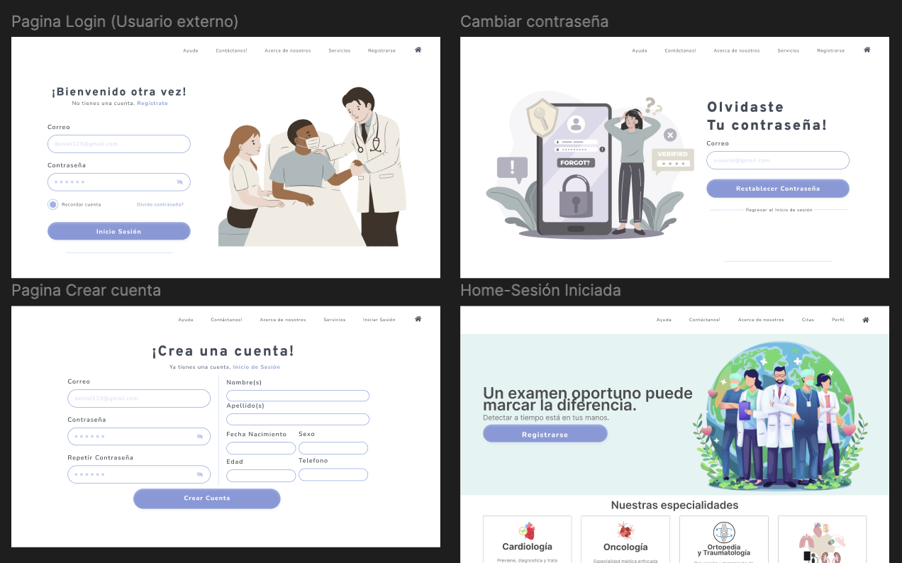

# 2.1.3. Módulo 3
## Gestión de Usuarios y Seguridad

### Descripción general
Este módulo permite la administración de cuentas y accesos tanto para **usuarios internos** (personal clínico y administrativo) como para **usuarios externos** (pacientes o público general).  
Para mantener una estructura organizada y segura, el módulo se divide en dos secciones:

---

### Gestión de Usuarios Internos

**Descripción:**  
Gestiona las cuentas, roles y permisos del personal médico, enfermeros, administrativos y encargados de compras que acceden al ERP interno.  
Incluye control de sesiones, autenticación y registro de accesos para mantener la seguridad del sistema.

#### Requerimientos Funcionales

| ID | Nombre | Historia de Usuario |
|----|---------|---------------------|
| **RF1** | Administración de Roles | **Como** administrador, **quiero** crear y gestionar roles internos (Administrador, Médico, Enfermero, Compras) para asignar accesos adecuados. |
| **RF2** | Asignación de Permisos | **Como** administrador, **quiero** definir permisos específicos por rol, para evitar accesos no autorizados a información sensible. |
| **RF3** | Registro de Usuarios Internos | **Como** administrador, **quiero** registrar nuevos usuarios internos en el sistema con su número de empleado y credenciales institucionales. |
| **RF4** | Control de Inicio de Sesión Interno | **Como** usuario interno, **quiero** iniciar sesión con credenciales institucionales, para acceder al ERP de forma segura. |
| **RF5** | Gestión de Sesiones Internas | **Como** administrador, **quiero** monitorear sesiones activas de empleados, para mantener el control de accesos en tiempo real. |
| **RF6** | Registro de Accesos Internos | **Como** administrador, **quiero** consultar un historial de accesos de usuarios internos, para verificar el uso del sistema y posibles incidencias. |

### Interces Gráficas 

Las siguientes imágenes muestran los mockups propuestos en Figma para la implementación de las interfaces de usuario del módulo de Gestión de Usuarios y Seguridad. En especifico en el area de los usuarios internos.

---

### Gestión de Usuarios Externos

**Descripción:**  
Administra el registro, autenticación y manejo de cuentas de pacientes o usuarios externos que acceden al portal web del sistema.  
Incluye mecanismos de recuperación de contraseña, políticas de seguridad y actualización de perfil personal.

#### Requerimientos Funcionales

| ID | Nombre | Historia de Usuario |
|----|---------|---------------------|
| **RF7** | Registro de Pacientes | **Como** usuario, **quiero** registrarme en el sistema con mi información personal para poder acceder al portal de pacientes. |
| **RF8** | Control de Inicio de Sesión Externo | **Como** usuario, **quiero** iniciar sesión con mi correo y contraseña para ingresar de manera segura. |
| **RF9** | Recuperación de Contraseña | **Como** usuario, **quiero** recuperar o restablecer mi contraseña de manera segura en caso de olvido. |
| **RF10** | Autenticación Segura | **Como** sistema, **quiero** verificar las credenciales mediante mecanismos seguros, para proteger la información clínica y personal. |
| **RF11** | Políticas de Contraseñas | **Como** administrador, **quiero** definir reglas de complejidad de contraseñas, para aumentar la seguridad del portal. |
| **RF12** | Gestión de Perfil de Paciente | **Como** usuario, **quiero** actualizar mis datos personales, para mantener mi información actualizada en el sistema. |
| **RF13** | Cierre de Sesión | **Como** usuario, **quiero** cerrar sesión manualmente para reducir riesgos de accesos indebidos a mi cuenta. |

### Interfaces Gráficas 

Las siguientes imágenes muestran los mockups propuestos en Figma para la implementación de las interfaces de usuario del módulo de Gestión de Usuarios y Seguridad, en la sección de usuarios externos.

---