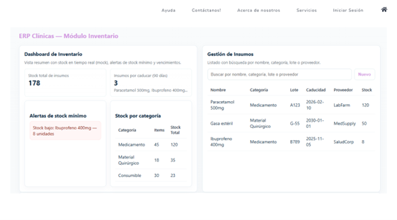
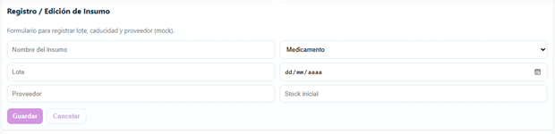
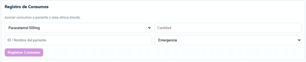
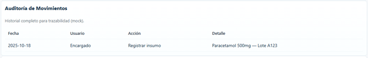

# 2.1.4. Módulo 4
# Inventario Médico
## Descripción General

El Módulo de Inventario Médico permite gestionar de forma eficiente los medicamentos e insumos utilizados en la clínica. Centraliza el control del stock en tiempo real, evitando pérdidas, desabastecimiento y uso de productos vencidos. Además, facilita el seguimiento de consumos por paciente y por área, permitiendo optimizar costos y abastecimiento.
# Requerimientos Funcionales – Módulo 4: Inventario Médico

| ID    | Nombre                         | Historia de Usuario                                                                                   |
|-------|--------------------------------|------------------------------------------------------------------------------------------------------|
| RF-01 | Registro de insumos             | Como **encargado de inventario**, quiero registrar insumos con datos de lote, caducidad y proveedor, para garantizar trazabilidad y control. |
| RF-02 | Categorización de insumos       | Como **encargado de inventario**, quiero clasificar los insumos por categoría (medicamentos, material quirúrgico, etc.), para facilitar su búsqueda y gestión. |
| RF-03 | Búsqueda de Insumos             | Como **encargado de inventario**, quiero poder buscar insumos por nombre, categoría, lote o proveedor, para localizar rápidamente el producto que necesito consultar o actualizar. |
| RF-04 | Consulta de stock en tiempo real| Como **médico o enfermero**, quiero consultar el stock disponible en tiempo real, para asegurar la disponibilidad de insumos antes de realizar procedimientos. |
| RF-05 | Alertas de stock mínimo         | Como **encargado de inventario**, quiero recibir alertas cuando un insumo llegue a su stock mínimo, para solicitar reposición a tiempo. |
| RF-06 | Alertas de vencimiento          | Como **encargado de inventario**, quiero recibir notificaciones de próximos vencimientos de medicamentos, para evitar su uso en pacientes. |
| RF-07 | Registro de consumos por paciente| Como **médico o enfermero**, quiero registrar los insumos utilizados en la atención de un paciente, para mantener un historial de consumo asociado a su ficha clínica. |
| RF-08 | Registro de consumos por área   | Como **encargado de inventario**, quiero asociar los consumos de insumos a un área clínica (consultorio, emergencia, hospitalización), para analizar costos por área. |
| RF-09 | Control de entradas de inventario| Como **encargado de inventario**, quiero registrar las entradas de insumos recibidos, para mantener actualizado el stock y conciliarlos con compras. |
| RF-10 | Reportes de consumo             | Como **encargado de inventario**, quiero generar reportes de consumo de insumos por paciente, área o periodo, para optimizar costos y compras futuras. |
| RF-11 | Auditoría de Movimientos        | Como **administrador**, quiero mantener un historial completo de todas las entradas, salidas y consumos de insumos, para facilitar trazabilidad y auditorías internas. |
| RF-12 | Restricción de permisos         | Como **administrador**, quiero que solo usuarios autorizados (médicos, enfermeros) puedan registrar consumos, para evitar accesos no autorizados. |

