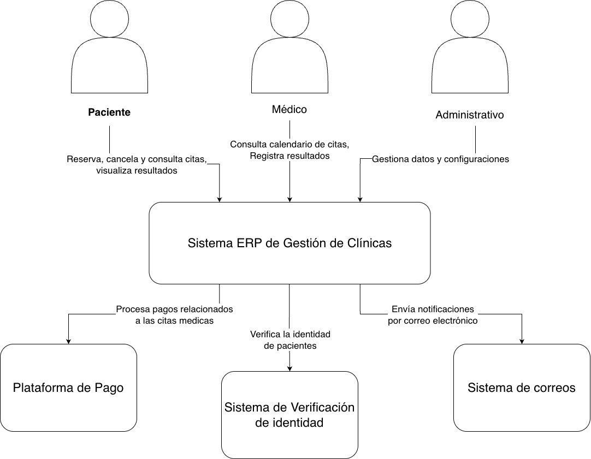

> [6. Documentación de Arquitectura (Bosquejo)](../6.md) › [6.1. Diagrama de Contexto](6.1.md)

# 6.1. Diagrama de Contexto

En el Diagrama de Contexto, se define cómo el sistema se conecta con el entorno y sus usuarios.

---

[🏠 Home](../../README.md) | [Siguiente ➡️](../6.2/6.2.md)