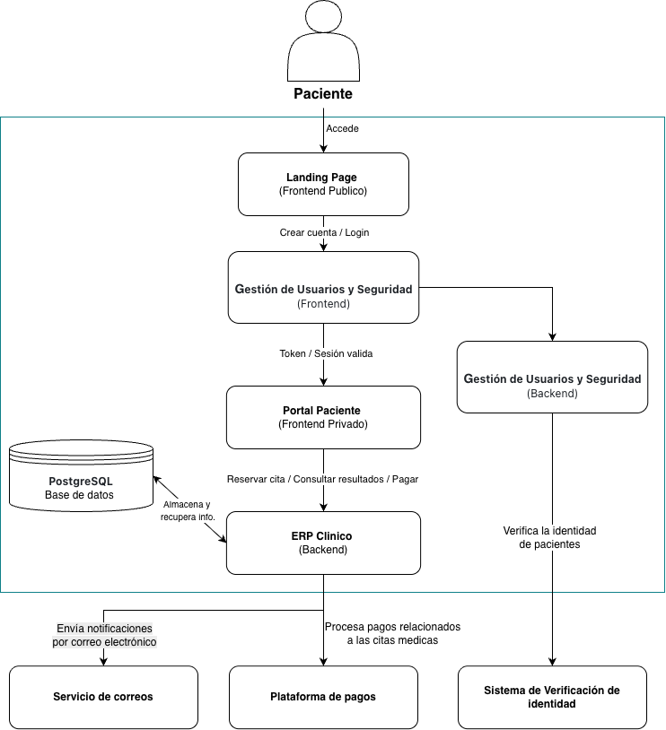
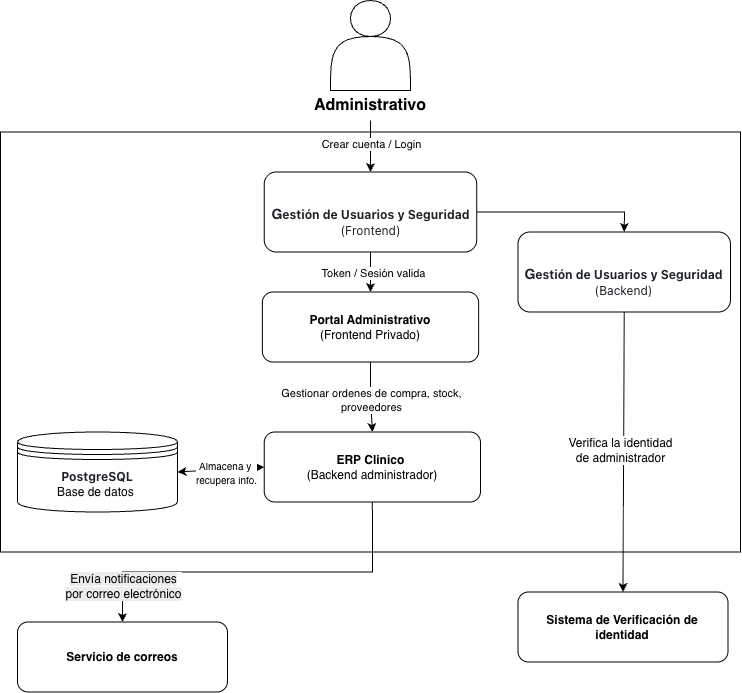
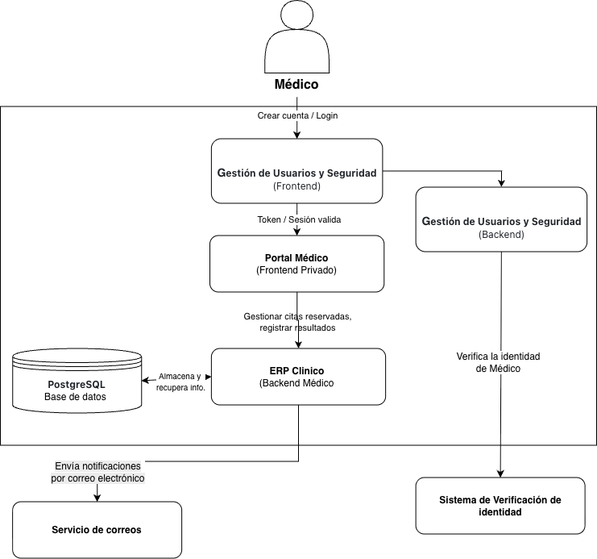

> [6. Documentación de Arquitectura (Bosquejo)](../6.md) › [6.2. Diagrama de Contenedores](6.2.md)

# 6.2. Diagrama de Contenedores

Se presenta una visión detallada de los componentes principales del sistema. Este nivel está dirigido a los equipos técnicos que necesitan entender la arquitectura general.

### Diagrama contenedores (paciente )

### Diagrama contenedores (Administrador )

### Diagrama contenedores (Medico)

---

[⬅️ Anterior](../6.1/6.1.md) | [🏠 Home](../../README.md) | [Siguiente ➡️](../6.3/6.3.md)