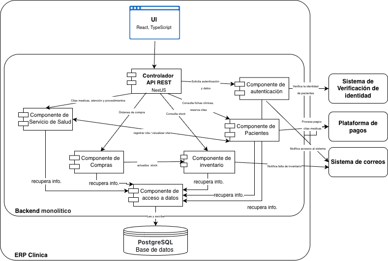

> [6. Documentación de Arquitectura (Bosquejo)](../6.md) › [6.3. Diagrama de Componentes](6.3.md)

# 6.3. Diagrama de Componentes

Se desglosan los elementos internos dentro de cada contenedor, mostrando sus interacciones específicas. Este nivel es útil para identificar dependencias y optimizar el diseño interno de cada contenedor.

---

[⬅️ Anterior](../6.2/6.2.md) | [🏠 Home](../../README.md) | [Siguiente ➡️](../6.4/6.4.md)