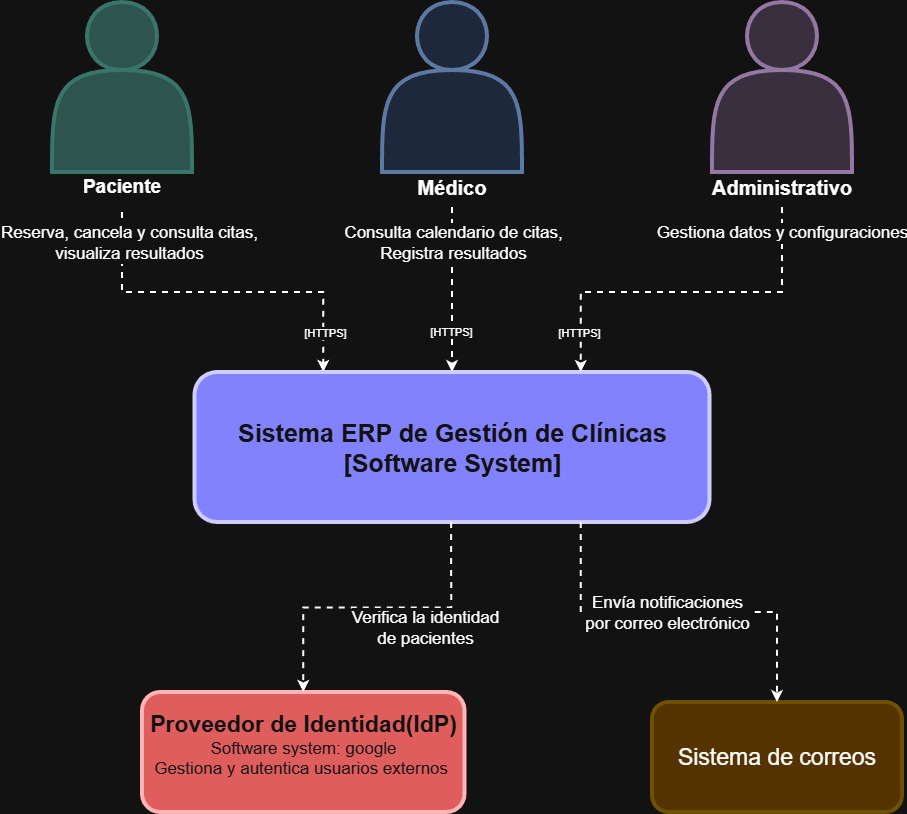
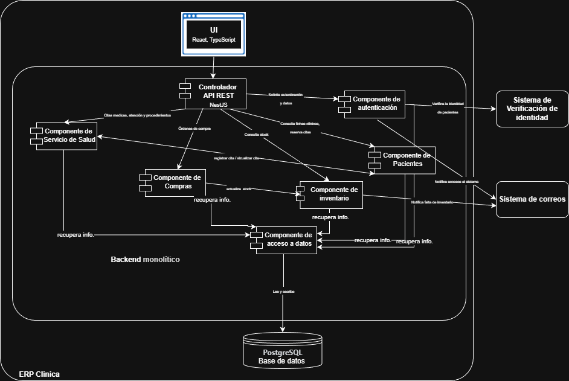
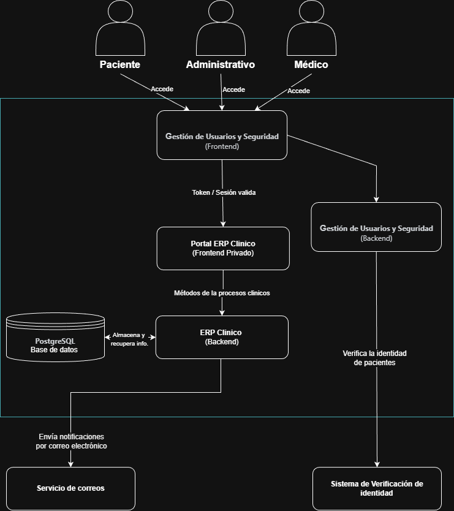
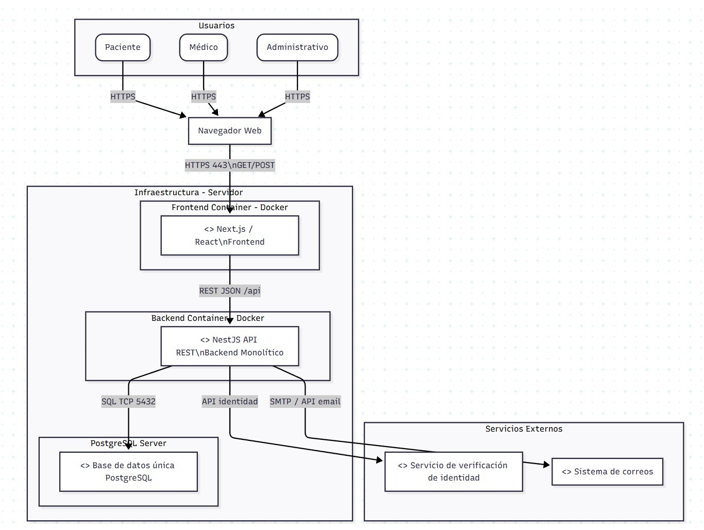

> [9. Metodología de Diseño de Arquitectura - Aplicación de ADD](../../9.md) › [9.2. Iteración 1: Definir la estructura general del sistema](../9.2.md) › [9.2.5. Vistas y Decisiones](9.2.5.md)

# 9.2.5. Vistas y Decisiones

## Diagrama de Contexto

## Diagrama de Componentes

## Diagrama de Contenedores

## Diagrama de Despliegue

---

[⬅️ Anterior](../9.2.4/9.2.4.md) | [🏠 Home](../../../README.md) | [Siguiente ➡️](../9.1.6/9.1.6.md)