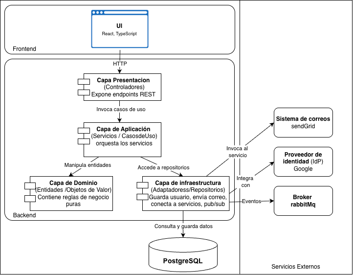

> [9. Metodología de Diseño de Arquitectura - Aplicación de ADD](../../9.md) › [9.3. Iteración 2: Identificar estructuras para soportar la funcionalidad primaria](../9.3.md) › [9.3.5. Vistas y Decisiones](9.3.5.md)

# Vistas y Decisiones

## Modelo de Datos Lógico del ERP CliniSys

El siguiente diagrama representa el **modelo de datos lógico** definido en esta iteración.  
Resume las entidades principales involucradas en los módulos **Servicios de Salud, Compras, Inventario Médico y Seguridad**, así como sus relaciones clave.  
Este modelo permite soportar los flujos funcionales primarios del sistema (CU01–CU16) y prepara la base estructural para el diseño físico y las tácticas de calidad de las próximas iteraciones.

## Modulo Gestión de Usuarios y seguridad

---

[⬅️ Anterior](../9.3.4/9.3.4.md) | [🏠 Home](../../../README.md) | [Siguiente ➡️](../9.3.6/9.3.6.md)